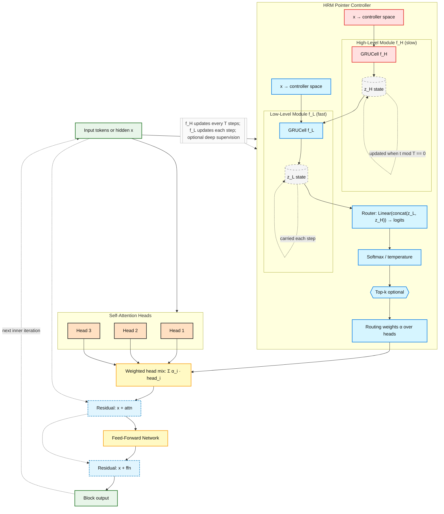
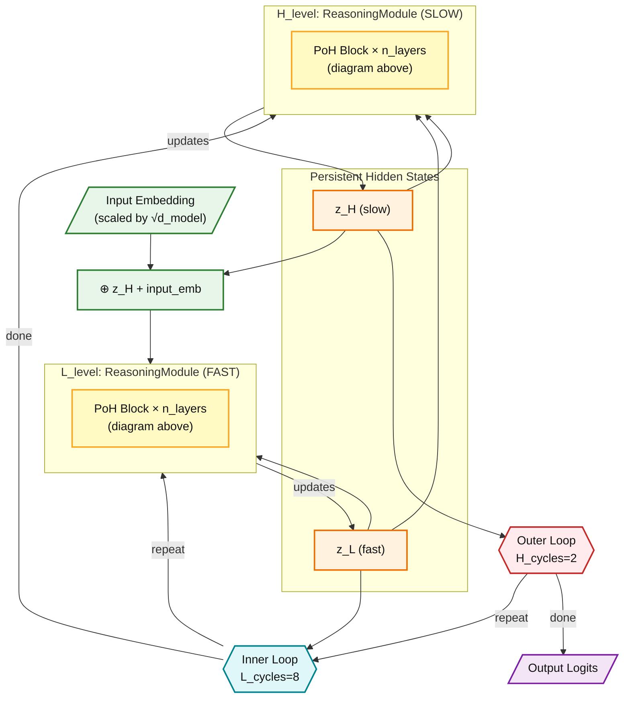
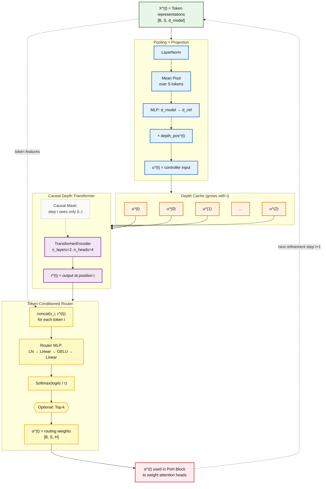

# Pointer-Over-Heads Transformer (PoT)

**Dynamic-Routing Transformer with Iterative Refinement**

[](https://doi.org/10.5281/zenodo.17958198) []() [](LICENSE) []()

## 🗞 News

- **Sudoku Benchmark (Colab, A100)** — train a master-level Sudoku solver:
  [](https://colab.research.google.com/github/Eran-BA/PoT/blob/main/notebooks/Sudoku_PoH_Benchmark.ipynb)

- Blog: BERT/GPT with inner thinking cycles (same parameter count)
  https://medium.com/@eranbt92/bert-gpt-with-inner-thinking-cycles-same-parameter-dc54dbdec61e

- New: HRM vs PoT comparison report — alignment and differences:
  [`experiments/HRM_VS_PoT_REPORT.md`](experiments/HRM_VS_PoT_REPORT.md)


> **PoH** is a modular transformer architecture that adds **head-wise routing** and **iterative refinement** to standard transformers. Designed for tasks requiring multi-step reasoning, in simple words "it is a BERT/GPT architecture with inner thinking cycles while keeping number of parameters same” -


## 🏗️ Architecture

### 1️⃣ PoH Block — The Atomic Unit

This is **one PoH Block** — a single transformer layer with dynamic head routing. The HRM Controller produces weights α that determine how much each attention head contributes to the output.



### 2️⃣ HybridPoHHRM — Full Architecture (for Sudoku/Maze)

For complex reasoning tasks, we wrap multiple PoH Blocks into a **two-timescale architecture** inspired by the [HRM paper](https://arxiv.org/abs/2506.21734). Each yellow box below contains the PoH Block shown above:



**Architecture Hierarchy:**

```
┌─────────────────────────────────────────────────────────────────┐
│  HybridHRMBase (Sudoku Solver)                                  │
│  ├── L_level: ReasoningModule (FAST, runs 8× per H_cycle)      │
│  │       └── PoH Block × 2 layers  ← (Diagram 1️⃣ above)        │
│  │               ├── HRM Controller (GRU f_L + f_H → α)        │
│  │               ├── Multi-Head Attention (weighted by α)      │
│  │               └── SwiGLU FFN + RMSNorm                      │
│  │                                                              │
│  └── H_level: ReasoningModule (SLOW, runs 2×)                  │
│          └── PoH Block × 2 layers  ← (Diagram 1️⃣ above)        │
│                  ├── HRM Controller (GRU f_L + f_H → α)        │
│                  ├── Multi-Head Attention (weighted by α)      │
│                  └── SwiGLU FFN + RMSNorm                      │
└─────────────────────────────────────────────────────────────────┘

Total reasoning steps = H_cycles × L_cycles = 2 × 8 = 16
Each step uses PoH Block with dynamic head routing (α weights)
```

| Component | What it does | Diagram |
|-----------|-------------|---------|
| **PoH Block** | Single layer: HRM Controller → α → Weighted MHA → FFN | 1️⃣ above |
| **ReasoningModule** | Stack of PoH Blocks with shared controller state | Inside 2️⃣ |
| **HybridHRMBase** | Two-timescale loop: L_level (fast) + H_level (slow) | 2️⃣ above |

**Key insight:** Diagram 1️⃣ shows *what happens at each step* (head routing). Diagram 2️⃣ shows *how steps are organized* into fast/slow timescales for iterative reasoning.

---

## 🧠 PoT in Plain English — Thinking in the Embedding Space

PoT (Pointer-over-Heads Transformer) is built around a simple idea:
instead of producing its output in one forward pass, the model thinks through its representations over several refinement steps.

At the start, every token has an initial embedding — a rough guess of what it means in context.
PoT doesn’t stop there.
It runs the same Transformer stack R times, updating those embeddings after each pass.
At every step, the model looks at its current hidden states and asks:

“Given what I know now, how should I use my attention heads to refine this understanding?”

Each iteration slightly reshapes the embedding space.
Tokens move, cluster, and separate as their meanings become sharper and more contextually grounded.
This process is not about memorizing — it’s about progressive self-correction.
By the final iteration, the embeddings encode a richer, more internally consistent view of the sequence.

What makes PoT different is the controller that guides this process.
For every token and refinement step, the controller decides how strongly to use each attention head.
Some heads specialize in local structure, others in global dependencies or positional cues.
By adjusting their mixture across iterations, the model can “compose” reasoning stages — starting with local alignment, then moving toward abstract relations or long-range coherence.

The controller itself operates on two timescales:

A fast component that adapts on every refinement step — reacting immediately to the evolving state of each token.

A slow component that changes less frequently — maintaining a broader contextual plan that influences the fast dynamics.

Together, they form a kind of hierarchical reasoning loop inside the embedding space.
Rather than running deeper networks, PoT deepens its thinking process — continuously refining the meaning of each token until the hidden representations stabilize.

In other words:

PoT doesn’t just compute token embeddings — it thinks within them, iteratively reorganizing its own representation space to reach a more coherent internal understanding.


### Comparison to related ideas

- SAEs vs PoT
  - SAEs: post-hoc interpretability (discover fixed features/circuits).
  - PoT: online computation (learned controller modulates head usage during inference).

- MoE vs PoT

| Aspect | MoE | PoT |
|:--|:--|:--|
| Routing target | Experts (sub-networks) | Attention heads (within block) |
| Tokens processed | Sparse subset | All tokens |
| Computation | Sparse/efficient | Dense/iterative |
| Routing frequency | Once per forward | Every refinement step (R) |
| Controller | Shallow gate | Two-timescale (f_L fast, f_H slow) |
| Goal | Throughput/scale | Adaptive reasoning |


### Recursive Transformers (TRM) vs PoT

Reference: [Tiny Recursive Models (TRM)](https://github.com/SamsungSAILMontreal/TinyRecursiveModels)

| Aspect | TRM (TinyRecursiveModels) | PoT (Pointer‑over‑Heads) |
|:--|:--|:--|
| Motivation | Compress depth via recursive weight tying | Make attention adaptive via dynamic head routing |
| Iteration type | Reuse the same block output as next input (recurrence) | Iterative refinement with per‑token per‑head routing |
| Routing | None (uniform computation) | α[token, iter, head] changes every refinement step |
| Controller | None (deterministic recurrence) | Hierarchical controller: f_L (fast), f_H (slow, period T) |
| Granularity | Whole‑block | Attention‑head |
| Goal | Parameter efficiency (simulate deep nets) | Adaptive reasoning / dynamic information flow |

Summary: TRM repeats the same computation to act deeper; PoT refines the computation itself to act smarter. While both do multiple passes, TRM’s steps are uniform across tokens with tied weights, whereas PoT learns a two‑timescale controller to modulate each head’s contribution per token and per iteration.


### Installation

```bash
git clone https://github.com/Eran-BA/PoT.git
cd PoT
source venv/bin/activate  # Activate virtual environment
pip install pyyaml datasets  # For NLI benchmarks
```

**Key Components:**
- **HRM Controller**: Two-timescale recurrent modules (from HRM paper)
  - **f_L (HRM inner loop)**: Updates every refinement step - fast, reactive processing
  - **f_H (HRM outer loop)**: Updates every T steps (T=4) - slow, strategic planning
- **Router**: Produces per-token, per-head routing weights α from f_L state
- **Weighted Mix**: Combines attention heads based on α
- **Skip Connections**: Residual connections around attention and FFN
- **Refinement**: Model refines representation R times per forward pass (R=12 optimal)

### Hierarchy (HybridPoHHRM)

```
HybridHRMBase                    # Two-timescale reasoning wrapper
  │
  ├── L_level: ReasoningModule   # FAST (8 cycles per H_cycle)
  │       └── PoH Block × 2      # See Diagram 1️⃣ above
  │               ├─ HRM Controller (GRU f_L + f_H → α)
  │               ├─ Multi-Head Attention (weighted by α)
  │               └─ SwiGLU FFN + RMSNorm
  │
  └── H_level: ReasoningModule   # SLOW (2 cycles total)
          └── PoH Block × 2      # See Diagram 1️⃣ above
                  ├─ HRM Controller (GRU f_L + f_H → α)
                  ├─ Multi-Head Attention (weighted by α)
                  └─ SwiGLU FFN + RMSNorm

Total reasoning steps: H_cycles × L_cycles = 2 × 8 = 16
```

### Key Features

1. **Head-Wise Routing**: Dynamically select or weight attention heads per token
   - **Soft routing**: Differentiable softmax over heads
   - **Top-k routing**: Sparse binary mask (select top-k heads)
   - Controlled by **HRM inner loop (f_L)** - updates every refinement step

2. **Iterative Refinement**: Apply the stack R times for multi-step reasoning
   - **R=12 refinement steps optimal** (from empirical analysis)
   - Optional residual connections across refinement steps (ReZero-style)
   - ACT halting for adaptive computation

3. **Positional Encoding**: Config-switchable (none/absolute/rotary)
   - `"none"`: Permutation-invariant tasks
   - `"absolute"`: Learned embeddings (GPT-2 style)
   - `"rotary"`: RoPE (LLaMA style, optional)

4. **Parameter Parity**: **0.27% overhead** vs baseline TransformerEncoder
   - Lightweight router: `d_model → d_model/4 → n_heads`
   - Optional bias stripping to maintain parity

---

## 🚀 Sudoku Benchmark

Train a master-level Sudoku solver using the HybridPoHHRM architecture:

```bash
# Download dataset and train
python experiments/sudoku_poh_benchmark.py --download --model hybrid

# Or run in Colab (A100 recommended)
```

[](https://colab.research.google.com/github/Eran-BA/PoT/blob/main/notebooks/Sudoku_PoH_Benchmark.ipynb)

**Features:**
- ✅ 1000 extreme Sudoku puzzles with 1000 augmentations each
- ✅ HybridPoHHRM two-timescale reasoning (L_level fast + H_level slow)
- ✅ Constraint loss for Sudoku rule enforcement
- ✅ ~25.8M parameters, trains in ~10 hours on A100

**Target:** [HRM paper](https://arxiv.org/abs/2506.21734) achieves 55% grid accuracy on Sudoku-Extreme.

**See also:** [experiments/](experiments/) for archived benchmarks (Maze, NLI, Connect Four)

---

## 📓 Interactive Notebooks

- **Sudoku_PoH_Benchmark** 🆕 — Train a master-level Sudoku solver (A100) [Recommended]
  
  [](https://colab.research.google.com/github/Eran-BA/PoT/blob/main/notebooks/Sudoku_PoH_Benchmark.ipynb)

**See:** [notebooks/](notebooks/) for archived notebooks (Maze, NLI, GPT, Connect Four)

---

## 🧪 Testing

```bash
# Run all tests
pytest tests/test_poh_modules.py -v

# Expected: 17 passed in ~1.3s
```

**Test coverage:**
- ✅ Parameter parity (≤1% delta)
- ✅ Routing correctness (soft sums to 1, top-k is sparse)
- ✅ ACT halting (reduces computation)
- ✅ Gradient flow (end-to-end)
- ✅ Positional encoding modes
- ✅ Outer residual (ReZero initialization)
- ✅ Drop-in compatibility with PyTorch

---

## 🎛️ Configuration

### HybridPoHHRM (Sudoku/Reasoning Tasks)

```python
from src.pot.models import HybridPoHHRMSolver

model = HybridPoHHRMSolver(
    d_model=512,          # Hidden dimension
    n_heads=8,            # Attention heads
    d_ff=2048,            # FFN dimension
    H_cycles=2,           # Outer loop iterations (slow)
    L_cycles=8,           # Inner loop iterations (fast)
    H_layers=2,           # Layers in H_level module
    L_layers=2,           # Layers in L_level module
    T=4,                  # HRM period for pointer controller
    dropout=0.0,          # Dropout rate (HRM uses 0)
    hrm_grad_style=True,  # Only last L+H calls get gradients
    halt_max_steps=4,     # ACT outer steps (1=disabled)
    num_puzzles=1,        # Number of puzzle embeddings
)
```

**Or via CLI (HRM-aligned configuration):**

```bash
python experiments/sudoku_poh_benchmark.py \
    --download \
    --model hybrid \
    --hrm-grad-style \
    --halt-max-steps 4 \
    --async-batch \
    --lr 1e-4 \
    --batch-size 768 \
    --weight-decay 1.0 \
    --puzzle-optimizer signsgd \
    --beta2 0.95 \
    --warmup-steps 2000 \
    --lr-min-ratio 0.1 \
    --constraint-weight 0
```

**Key parameters:**
- `H_cycles × L_cycles` = total reasoning steps (2×8 = 16)
- `H_layers`, `L_layers` = depth of each module
- `T` = how often the slow GRU (f_H) updates in the pointer controller

---

## 📈 Logging & Visualization

Track per-iteration dynamics with `InnerLoopLogger` and visualize with provided scripts:

```bash
python scripts/plot_inner_vs_outer.py --csv results/run1/innerloop.csv
python scripts/plot_results.py
```

See [examples/poh_usage.py](examples/poh_usage.py) for usage.

---

## 📚 Documentation

### Quick Links
- **[docs/](docs/)** - Complete documentation index
- **[docs/architecture/](docs/architecture/)** - Architecture guides
- **[docs/guides/](docs/guides/)** - User & developer guides  
- **[examples/poh_usage.py](examples/poh_usage.py)** - 6 usage examples
- **[examples/synthetic/](examples/synthetic/)** - Synthetic task experiments

### Key Documents
- **[Terminology Guide](docs/TERMINOLOGY_GUIDE.md)** - **ESSENTIAL:** Official HRM-aligned terminology
- **[Architecture Summary](docs/architecture/POH_ARCHITECTURE_SUMMARY.md)** - Comprehensive architecture guide
- **[Refinement Iteration Guide](docs/POH_ITERATION_GUIDE.md)** - Why R=12 refinement steps is optimal
- **[HRM vs Refinement](docs/HRM_VS_REFINEMENT_LOOPS.md)** - Three nested loops explained
- **[Quick Start](QUICK_START.md)** - Copy-paste commands for NLI benchmarks
- **[Contributing Guide](docs/guides/CONTRIBUTING.md)** - Development guidelines
- **[Determinism Guide](docs/guides/DETERMINISM.md)** - Reproducibility best practices
- **[Running Benchmarks](docs/guides/RUNNING_BENCHMARKS.md)** - Full benchmark guide

---

## 🛠️ Development

### Requirements

- Python 3.9+
- PyTorch 2.0+
- NumPy, Matplotlib, Seaborn, SciPy, pandas, pytest, PyYAML

**Optional:**
- `rotary-embedding-torch` (for RoPE support)
- `datasets` (for real NLI benchmarks - Hugging Face)
- `maze-dataset` (for maze generation benchmarks)
- `transformers` (for BERT baselines in A/B tests)

### Project Structure

```
PoT/
├── src/
│   ├── pot/
│   │   ├── modules/          # PoHBlock, PoHStack, IterRefiner, Positional Encoding
│   │   ├── logging/          # Inner-loop CSV logger
│   │   ├── core/             # HRM controller, losses, metrics
│   │   ├── tasks/            # Task adapters (dependency parsing, NLI)
│   │   ├── utils/            # Training utilities
│   │   └── models/           # High-level models (PoHGPT, BERT baselines)
│   └── models/               # Legacy model definitions
├── scripts/
│   ├── train.py              # Unified training entry point
│   ├── plot_results.py       # Auto-plotting
│   ├── plot_inner_vs_outer.py  # Inner-loop visualization
│   └── make_readme_tables.py   # Table generation
├── tests/
│   ├── test_poh_modules.py   # 17 tests (all passing)
│   └── test_core.py          # Core component tests
├── examples/
│   ├── poh_usage.py          # Usage examples
│   ├── poh_gpt_usage.py      # GPT-style usage
│   └── synthetic/            # Synthetic tasks (sorting)
├── experiments/
│   ├── configs/              # YAML configs per task (parsing, nli, lm)
│   ├── results/              # Experiment CSVs
│   ├── quick_nli_test.py     # 3-min NLI test
│   ├── fair_ab_nli.py        # Full synthetic NLI benchmark
│   ├── real_nli_benchmark.py # Real SNLI/MultiNLI benchmark
│   ├── quick_ab_test.py      # GPT quick test
│   ├── fair_ab_lm.py         # Full GPT benchmark
│   ├── maze_ab_proper_generation.py  # Maze solving A/B test (with maze-dataset)
│   ├── maze_scaling_benchmark.py     # Maze scaling 8×8→30×30
│   └── connect_four_ab_test.py       # Connect Four A/B test
└── docs/
    ├── architecture/         # Architecture documentation
    ├── guides/               # User guides
    ├── tasks/                # Task-specific docs
    └── POH_ITERATION_GUIDE.md  # Iteration count guide
```

### Contributing

See [CONTRIBUTING.md](CONTRIBUTING.md) for development guidelines.

---

## 📖 Citation

```bibtex
@software{benartzy2025poh,
  author       = {Eran Ben Artzy},
  title        = {Pointer-over-Heads Transformer: Dynamic Multi-Head Attention with Adaptive Routing},
  year         = {2025},
  publisher    = {Zenodo},
  doi          = {10.5281/zenodo.17958198},
  url          = {https://doi.org/10.5281/zenodo.17958198}
}
```

Or cite as:

> Ben Artzy, E. (2025). Pointer-over-Heads Transformer: Dynamic Multi-Head Attention with Adaptive Routing. Zenodo. https://doi.org/10.5281/zenodo.17958198

---

## 📄 License

Apache 2.0 - See [LICENSE](LICENSE) for details.

---

## 🙏 Acknowledgments & References

This work builds upon several foundational papers:

### Core Inspirations
- **Pointer Networks** - Vinyals et al. (2015): [https://arxiv.org/pdf/1506.03134](https://arxiv.org/pdf/1506.03134)
  - *Foundation for attention-based pointer mechanisms*
- **Hierarchical Reasoning Model (HRM)** - Sapient Intelligence, Singapore (2025): [https://arxiv.org/abs/2305.19472](https://arxiv.org/abs/2305.19472)]
  - *Two-timescale recurrent controller for routing*

### Technical Components
- **Adaptive Computation Time (ACT)** - Graves (2016): [https://arxiv.org/abs/1603.08983](https://arxiv.org/abs/1603.08983)
  - *Learned halting for variable computation*
- **Transformer** - Vaswani et al. (2017): [https://arxiv.org/abs/1706.03762](https://arxiv.org/abs/1706.03762)
  - *Base architecture*

### Technical Components (continued)
- **maze-dataset** - Ivanitskiy et al. (2023): [https://arxiv.org/abs/2309.10498](https://arxiv.org/abs/2309.10498)
  - *High-quality maze generation library for ML benchmarking*

### Implementation
- Built on PyTorch's `MultiheadAttention`
- Evaluation metrics from Universal Dependencies project
- Maze generation using [`maze-dataset`](https://github.com/understanding-search/maze-dataset) library

---

## 🚀 Status

**v2.0.0** - HybridPoHHRM Focus 🎯

### Core Architecture ✅
- [x] HybridHRM two-timescale reasoning (L_level fast + H_level slow)
- [x] PoH Block with dynamic head routing (HRM Controller → α weights)
- [x] Modular code structure (`src/pot/models/`, `src/data/`, `src/training/`)
- [x] Constraint loss for Sudoku rule enforcement
- [x] 17/17 tests passing

### Sudoku Benchmark 🔄
- [x] HybridPoHHRMSolver implementation (~25.8M params)
- [x] Sudoku-Extreme dataset integration (1000 puzzles × 1000 augmentations)
- [x] Colab notebook for A100 training
- [x] Reaching HRM paper target (55% grid accuracy)

### Archived (in `archive/` and `experiments/`)
- NLI, GPT, Maze, Connect Four benchmarks

---

## 🔬 Current (already implemented) Research Directions

The above architecture uses **GRU cells** for the recurrent controller modules (f_L and f_H). Importantly, these GRUs operate **across depth (refinement iterations)**, not across the input sequence length. Each token maintains its own independent controller state that evolves as the model iterates through reasoning steps.

This is not a fixed design choice — the GRU can be replaced with other recurrent units:

### Option 1: Alternative Recurrent Units

- **LSTM** — Long Short-Term Memory for stronger gating
- **xLSTM** — Extended LSTM with exponential gating and matrix memory ([Beck et al., 2024](https://arxiv.org/abs/2405.04517))
- **Mamba / S4** — State-space models for efficient long-range dependencies
- **minGRU / minLSTM** — Simplified variants for reduced overhead

The key insight is that any recurrent unit capable of maintaining state **across depth** (i.e., across iteration steps, not across tokens) can serve as the controller backbone.

### Option 2: Causal Depth Transformer Controller

A more expressive alternative is to replace the GRU entirely with a **causal Transformer operating over the depth axis**. Unlike GRUs which only have implicit access to past states through compressed hidden states, a depth Transformer can explicitly attend to *any* relevant previous refinement step.

**Core idea:** At refinement step t, compute routing weights α⁽ᵗ⁾ using only past and current depth states {x⁽⁰⁾, ..., x⁽ᵗ⁾}, then use α⁽ᵗ⁾ to mix attention heads.

**Architecture:**
```
┌─────────────────────────────────────────────────────────────┐
│  Causal Depth Transformer Controller                        │
│                                                             │
│  Input options:                                             │
│  ├── (A) Token-wise: u_i^(t) = W_u·x_i^(t) + pos^(t)       │
│  └── (B) Pooled: g^(t) = Pool(X^(t)), u^(t) = W_u·g + pos  │
│                                                             │
│  Depth sequence U^(0:t) → DepthTransformer (causal mask)   │
│  └── 1-2 layers, d_ctrl = d_model/4, n_heads = 4           │
│                                                             │
│  Output y^(t) → Router → α^(t) routing weights             │
│  └── Token-conditioned: logits = W_r·[x_i | y^(t)]         │
└─────────────────────────────────────────────────────────────┘
```

**Detailed Architecture Diagram:**

```
                    CAUSAL DEPTH TRANSFORMER CONTROLLER
    ═══════════════════════════════════════════════════════════════

    INPUT (at refinement step t)
    ┌─────────────────────────────────────────────────────────────┐
    │  X^(t) = [x₁, x₂, ..., xₛ]   (S tokens, d_model each)      │
    └───────────────────────────┬─────────────────────────────────┘
                                │
                                ▼
    ┌─────────────────────────────────────────────────────────────┐
    │                    POOLING + PROJECTION                     │
    │  ┌─────────────┐    ┌─────────────┐    ┌─────────────────┐ │
    │  │  LayerNorm  │ →  │  Mean Pool  │ →  │ Linear+GELU+Lin │ │
    │  │   (X^(t))   │    │  over S     │    │ d_model → d_ctrl│ │
    │  └─────────────┘    └─────────────┘    └────────┬────────┘ │
    │                                                  │          │
    │                                    u^(t) = ctrl_input + pos^(t)
    └──────────────────────────────────────────────────┬──────────┘
                                                       │
                                                       ▼
    ┌─────────────────────────────────────────────────────────────┐
    │                    DEPTH CACHE (grows with t)               │
    │                                                             │
    │    U = [ u^(0), u^(1), u^(2), ..., u^(t) ]                 │
    │          ↓       ↓       ↓             ↓                    │
    │        step 0  step 1  step 2  ...  current                │
    │                                                             │
    └───────────────────────────┬─────────────────────────────────┘
                                │
                                ▼
    ┌─────────────────────────────────────────────────────────────┐
    │            CAUSAL DEPTH TRANSFORMER (over depth axis)       │
    │                                                             │
    │    ┌───────────────────────────────────────────────────┐   │
    │    │  TransformerEncoder (n_layers=2, n_heads=4)       │   │
    │    │                                                   │   │
    │    │      Attention Mask (CAUSAL over depth):          │   │
    │    │      ┌─────────────────────────┐                  │   │
    │    │      │  step:  0   1   2   t   │                  │   │
    │    │      │    0   [✓] [✗] [✗] [✗]  │  ✓ = can attend  │   │
    │    │      │    1   [✓] [✓] [✗] [✗]  │  ✗ = masked out  │   │
    │    │      │    2   [✓] [✓] [✓] [✗]  │                  │   │
    │    │      │    t   [✓] [✓] [✓] [✓]  │  ← current step  │   │
    │    │      └─────────────────────────┘                  │   │
    │    │                                                   │   │
    │    │  Each step can only see past steps (causal)       │   │
    │    └───────────────────────────────────────────────────┘   │
    │                          │                                  │
    │                          ▼                                  │
    │              Y = Transformer(U, causal_mask)               │
    │              r^(t) = Y[-1]  (last position = current step) │
    │                                                             │
    └───────────────────────────┬─────────────────────────────────┘
                                │
                                ▼
    ┌─────────────────────────────────────────────────────────────┐
    │               TOKEN-CONDITIONED ROUTER                      │
    │                                                             │
    │    For each token i:                                        │
    │    ┌────────────────────────────────────────────────────┐  │
    │    │  r^(t)  ──┐                                        │  │
    │    │           ├──→ concat ──→ [xᵢ | r^(t)]            │  │
    │    │  xᵢ^(t) ─┘                     │                   │  │
    │    │                                ▼                   │  │
    │    │                    ┌────────────────────┐          │  │
    │    │                    │  Router MLP        │          │  │
    │    │                    │  LN → Linear+GELU  │          │  │
    │    │                    │  → Linear → logits │          │  │
    │    │                    └─────────┬──────────┘          │  │
    │    │                              │                     │  │
    │    │                              ▼                     │  │
    │    │              logitsᵢ = [h₁, h₂, ..., hₕ]          │  │
    │    │                              │                     │  │
    │    │                    ┌─────────▼──────────┐          │  │
    │    │                    │ Softmax(logits/τ)  │          │  │
    │    │                    │ (temperature τ)    │          │  │
    │    │                    └─────────┬──────────┘          │  │
    │    │                              │                     │  │
    │    │                    ┌─────────▼──────────┐          │  │
    │    │                    │ Optional: Top-k    │          │  │
    │    │                    │ sparsification     │          │  │
    │    │                    └─────────┬──────────┘          │  │
    │    │                              ▼                     │  │
    │    │              αᵢ^(t) = [α₁, α₂, ..., αₕ]           │  │
    │    └────────────────────────────────────────────────────┘  │
    │                                                             │
    └───────────────────────────┬─────────────────────────────────┘
                                │
                                ▼
    ┌─────────────────────────────────────────────────────────────┐
    │                         OUTPUT                              │
    │                                                             │
    │    α^(t) = [α₁^(t), α₂^(t), ..., αₛ^(t)]                   │
    │                                                             │
    │    Shape: [Batch, Sequence, Heads]                         │
    │                                                             │
    │    Each αᵢ^(t) sums to 1.0 (softmax over heads)            │
    │    Used to weight attention head outputs in PoH Block      │
    │                                                             │
    └─────────────────────────────────────────────────────────────┘


    KEY DIFFERENCES FROM GRU CONTROLLER:
    ═══════════════════════════════════════════════════════════════

    ┌─────────────────────────┬───────────────────────────────────┐
    │      GRU Controller     │   Causal Depth Transformer        │
    ├─────────────────────────┼───────────────────────────────────┤
    │  h^(t) = GRU(x, h^(t-1))│  y^(t) = Attn(U^(0:t), causal)   │
    │                         │                                   │
    │  Compressed history     │  Explicit attention to ALL        │
    │  in fixed-size hidden   │  previous depth steps             │
    │  state h                │                                   │
    │                         │                                   │
    │  O(1) memory per step   │  O(t) memory (cache grows)        │
    │                         │                                   │
    │  Implicit past access   │  Explicit: step 10 can directly   │
    │  (through h)            │  attend to step 3's features      │
    │                         │                                   │
    │  Sequential processing  │  Parallel training possible       │
    │  (can't parallelize)    │  (with causal mask)               │
    └─────────────────────────┴───────────────────────────────────┘
```

**Empirical Results (Sudoku-Extreme benchmark):**

| Epoch | Transformer Cell | GRU Cell | Transformer Grid | GRU Grid |
|-------|------------------|----------|------------------|----------|
| 30 | 58.0% | ~55% | 0.0% | 0.0% |
| 47 | 61.7% | 62.7% | 0.0% | 0.1% |
| 62 | 63.6% | ~64% | 0.1% | ~0.8% |
| 70 | 64.6% | 65.2% | 0.6% | 1.3% |

**Verdict:** The Causal Depth Transformer achieves comparable performance to GRU, validating this alternative architecture for depth-wise control.

**Advantages:**
- **Explicit attention over depth history** — step 10 can directly reference step 3
- **Parallel training** — causal mask allows batched forward pass over all K steps
- **Better gradient flow** — residual connections avoid vanishing gradients
- **Interpretability** — attention weights show which past reasoning steps matter

**Implementation choices:**
1. **Recompute prefix** (simple): At step t, run DepthTx on [0..t]. O(t²) across steps, fine for K ≤ 16.
2. **KV-cache** (fast): Cache K/V for each layer over previous depth steps. O(t) per step.

**Recommended starting point:**
- Pooled controller input (Option B) for efficiency
- Token-conditioned routing for per-token expressivity
- 1-2 layer Transformer with d_ctrl = 128-256
- Recompute prefix first, add KV-cache later if needed

**Integration with HRM two-timescale design:**
- Keep f_H (slow) as GRU — updates rarely, doesn't need long-range depth attention
- Replace f_L (fast) with Depth Transformer — updates every step, benefits most

---

Different controller choices offer trade-offs in:
- Memory capacity and gradient flow
- Computational efficiency
- Expressiveness of the routing dynamics

---

### 3️⃣ Causal Depth Transformer Controller — Mermaid Diagram



**How it works:**

1. **Pool tokens** → compress X^(t) to single vector u^(t)
2. **Append to cache** → U = [u^(0), u^(1), ..., u^(t)]
3. **Causal attention** → Transformer attends only to past/current steps
4. **Route per-token** → combine r^(t) with each token x_i to produce α_i^(t)
5. **Apply to PoH Block** → α weights mix attention head outputs

---

**Questions?** Open an issue or see [QUICK_START.md](QUICK_START.md) for copy-paste commands!
