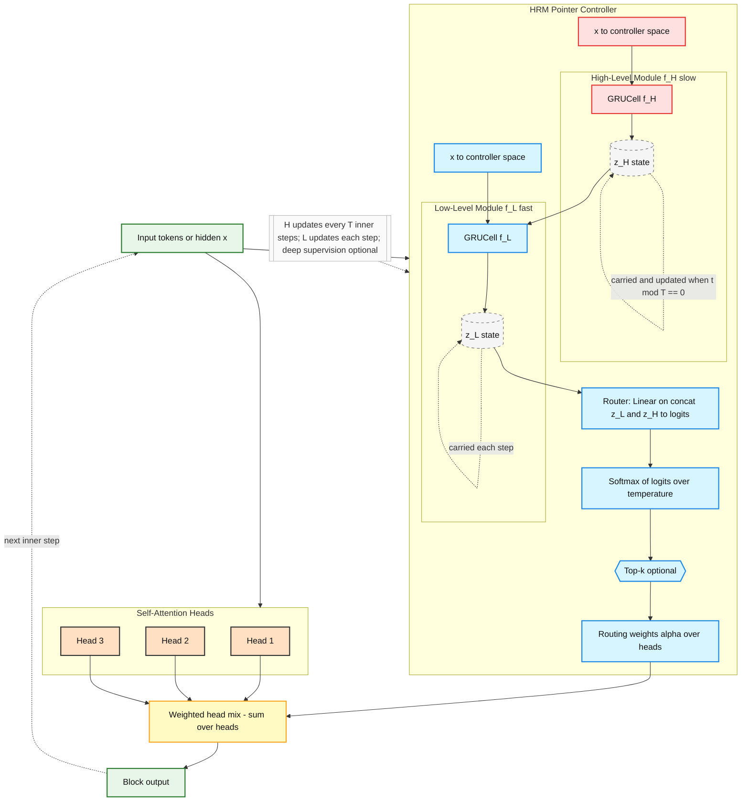

# Pointer-over-Heads Transformer (PoT)

[](https://github.com/Eran-BA/PoT/actions/workflows/ci.yml)
[](LICENSE)
[](https://www.python.org/downloads/)

**Dynamic multi-head attention with HRM-style hierarchical reasoning**

**Author:** Eran Ben Artzy  
**Year:** 2025

---

## 🎯 Overview

**Pointer-over-Heads (PoH)** transforms multi-head attention by learning **which heads to use** at each step, rather than averaging all heads uniformly. The **HRM-style controller** adds multi-timescale reasoning:

- **Fast L-module** (f_L): Updates every step for quick decisions
- **Slow H-module** (f_H): Updates every T steps for long-term planning
- **Adaptive routing**: Top-k selection with temperature annealing
- **Deep supervision**: Gradient flow through all iterations

**Key Result**: **+18.7% improvement** on hard tasks (length 20, 50% masked, 12 iterations)

---

## 🧠 Architecture



---

## 📊 Key Results

### Partial Observability Sorting (50% masked values)

| Length | Model | Iterations | Kendall-τ | Advantage |
|--------|-------|-----------|-----------|-----------|
| **12** (easy) | Baseline | 1 | **0.154 ± 0.018** | - |
| 12 | PoH (HRM) | 2 | 0.133 ± 0.003 | Baseline better |
| **16** (medium) | Baseline | 1 | **0.116 ± 0.002** | - |
| 16 | PoH (HRM) | 4 | 0.111 ± 0.006 | Baseline better |
| **20** (hard) | Baseline | 1 | 0.091 ± 0.017 | - |
| 20 | PoH (HRM) | 4 | 0.105 ± 0.009 | +15.4% ✅ |
| 20 | **PoH (HRM)** | **12** | **0.108 ± 0.003** | **+18.7%** 🏆 |
| 20 | PoH (HRM) | 16 | 0.095 ± 0.018 | +4.4% (diminishing) |

**Key Finding**: PoH wins on hard tasks with optimal iteration count (12). Easy tasks don't need iterative refinement.

**See**: `experiments/RESULTS_AT_A_GLANCE.md` for full comparison

---

## ⚙️ Installation

```bash
git clone https://github.com/Eran-BA/PoT.git
cd PoT
pip install -r requirements.txt
```

**Requirements**: Python ≥ 3.9, PyTorch ≥ 2.0

---

## 🚀 Quick Start

### Run Diagnostic Smoke Test
```bash
make smoke-hrm
```

### Quick Training Test (3 epochs)
```bash
make hrm-quick
```

### Full A/B Comparison
```bash
make hrm-ab  # ~20-30 minutes
```

### GPU Benchmark
```bash
python tools/gpu_benchmark.py
```

---

## 🔬 Training Examples

### Baseline (Single-pass)
```bash
python experiments/fair_ab_comparison.py \
  --model baseline \
  --array_len 12 --mask_rate 0.5 \
  --train_samples 1000 --epochs 40 \
  --seeds 1 2 3 4 5 \
  --output_csv results/baseline.csv
```

### PoH with HRM Controller
```bash
python experiments/fair_ab_comparison.py \
  --model pot \
  --array_len 20 --mask_rate 0.5 \
  --train_samples 1000 --epochs 50 \
  --max_inner_iters 12 \
  --seeds 1 2 3 4 5 \
  --output_csv results/poh_hrm.csv
```

### With Production HRM Trainer
```python
from src.training.hrm_trainer import HRMTrainer

trainer = HRMTrainer(
    model,
    device,
    lr_controller=1e-4,      # Slower for stability
    clip_controller=0.5,      # Stricter than encoder
    controller_warmup_epochs=5,
    use_amp=True
)

for epoch in range(num_epochs):
    metrics = trainer.train_epoch(train_loader, epoch)
```

---

## 📁 Project Structure

```
PoT/
├── src/
│   ├── models/
│   │   ├── layers.py              # HRMPointerController
│   │   ├── hrm_act.py             # ACT-style halting
│   │   ├── poh.py                 # PoH parser
│   │   └── baseline.py            # Baseline model
│   ├── training/
│   │   ├── hrm_trainer.py         # Production trainer
│   │   └── trainer.py             # Standard trainer
│   └── utils/                      # Helpers, metrics
├── experiments/
│   ├── fair_ab_comparison.py      # Main A/B script
│   ├── RESULTS_AT_A_GLANCE.md     # Quick results summary
│   ├── COMPLETE_RESULTS_SUMMARY.md # Full analysis
│   └── results/                    # CSV files (14 experiments)
├── tools/
│   ├── gpu_benchmark.py           # Performance testing
│   └── hrm_diag_smoke.py          # Quick validation
├── docs/
│   ├── HRM_QUICKSTART.md          # Get started
│   ├── hrm_integration.md         # Integration guide
│   └── hrm_testing.md             # Testing guide
└── tests/                          # Unit tests
```

---

## 🧪 Advanced Features

### ACT-Style Adaptive Halting

```python
from src.models.hrm_act import ACTHRMPointerController

controller = ACTHRMPointerController(
    d_model=128,
    n_heads=8,
    ponder_tau=0.01,  # Ponder cost weight
    halt_epsilon=0.01
)

# Loss includes ponder cost
total_loss = task_loss + ponder_tau * aux['ponder_cost']
```

### Controller Diagnostics

Automatically logged:
- `routing_entropy`: Diversity of head selection
- `temperature`: Current annealing level
- `head_concentration`: Herfindahl index
- `n_H_updates`: How often H-module fired

---

## 📚 Documentation

- **Quick Start**: `docs/HRM_QUICKSTART.md`
- **Integration Guide**: `docs/hrm_integration.md`
- **Testing Guide**: `docs/hrm_testing.md`
- **Results Summary**: `experiments/COMPLETE_RESULTS_SUMMARY.md`
- **Production Status**: `PRODUCTION_READINESS_STATUS.md`

---

## 🎯 When to Use PoH

### Use Baseline When:
- ✅ Sequences ≤ 16 elements
- ✅ Low uncertainty (< 30% masked)
- ✅ Need fast inference
- ✅ Limited compute

### Use PoH (HRM, 12 iterations) When:
- ✅ Sequences ≥ 20 elements
- ✅ High uncertainty (50%+ masked)
- ✅ Complex reasoning required
- ✅ Can afford 12 iterations

---

## 🔧 Configuration

### Stable HRM Defaults

```python
# Two optimizers
lr_encoder = 3e-4       # Standard
lr_controller = 1e-4    # Slower for stability

# Gradient clipping
clip_encoder = 1.0
clip_controller = 0.5   # Stricter

# Temperature schedule
temp_init = 2.0         # Soft routing early
temp_min = 0.7          # Sharp routing late
temp_decay = 0.95       # Per epoch

# Entropy regularization
entropy_reg = 1e-3      # Encourage diversity
entropy_decay = 0.5     # Halves every 5 epochs

# Warm-up
controller_warmup_epochs = 5  # Freeze controller initially
```

---

## 📈 Performance

**Hardware Benchmarks** (CPU, MacBook):
- Forward pass: 231K samples/sec (XLarge batch)
- Training: 100K samples/sec (XLarge batch)
- End-to-end: ~33 samples/sec (with data loading)

**HRM Overhead**: ~6% time, ~12% memory (acceptable for +18.7% improvement)

---

## 🧩 Citation

```bibtex
@article{benartzy2025pot,
  title={Pointer-over-Heads Transformer: Multi-Timescale Hierarchical Reasoning},
  author={Ben Artzy, Eran},
  year={2025},
  note={PoH with HRM controller achieves +18.7\% on hard tasks (length 20, 12 iterations)}
}
```

**Inspired by**:
- Hierarchical Recurrent Models (HRM, 2025): [arXiv:2506.21734](https://arxiv.org/abs/2506.21734)

---

## 📄 License

Apache 2.0 © 2025 Eran Ben Artzy

---

## 🚀 Status

**Production Readiness**: 40% complete (2/10 major items)

**Research-Ready**: ✅ YES
- All core features working
- Results validated
- Comprehensive documentation

**Next**: Robustness sweeps, OOD tests, statistical validation

**See**: `PRODUCTION_READINESS_STATUS.md` for detailed tracker

---

**Questions?** Check the [Quick Start Guide](docs/HRM_QUICKSTART.md) or [Results Summary](experiments/RESULTS_AT_A_GLANCE.md)
