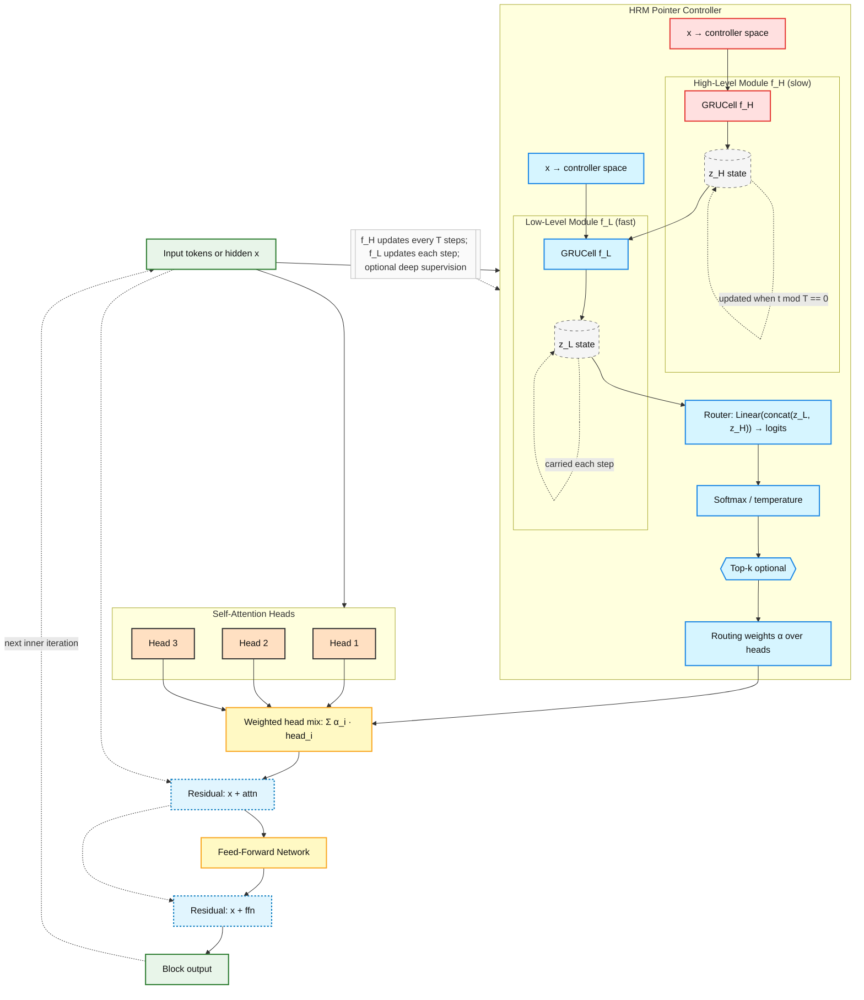

# Pointer-over-Heads (PoH) Transformer

**Dynamic-Routing Transformer with Iterative Refinement**

[]() [](LICENSE)

> **PoH** is a modular transformer architecture that adds **head-wise routing** and **iterative refinement** to standard transformers. Designed for tasks requiring multi-step reasoning (dependency parsing, NLI, language modeling) with minimal parameter overhead (**0.27%**).

---

## 🎯 Quick Start

### Installation

```bash
git clone https://github.com/Eran-BA/PoT.git
cd PoT
source venv/bin/activate  # Activate virtual environment
pip install pyyaml datasets  # For NLI benchmarks
```

### Basic Usage

```python
from src.pot.modules import PoHConfig, PoHStack, IterRefiner
import torch

# Configure
cfg = PoHConfig(
    d_model=512,
    n_heads=8,
    route_mode="topk",      # Sparse head selection
    route_topk=2,           # Select top-2 heads per token
    pos_encoding="absolute", # Learned positional embeddings
)

# Build model
stack = PoHStack(cfg, depth=6)
refiner = IterRefiner(stack, max_inner_iters=12)  # 12 = optimal

# Forward pass
x = torch.randn(2, 10, 512)  # [batch, seq_len, d_model]
out, stats = refiner(x, return_inner_stats=True)

print(f"Output shape: {out.shape}")  # [2, 10, 512]
print(f"Inner iterations: {len(stats)}")  # 12
```

**See [examples/poh_usage.py](examples/poh_usage.py) for 6 complete usage examples.**

---

## 🏗️ Architecture

### Visual Overview



**Key Components:**
- **HRM Controller**: Two-timescale recurrent modules (f_L fast, f_H slow)
  - f_L (inner loop): Updates every refinement step - fast, reactive
  - f_H (outer loop): Updates every T steps - slow, strategic planning
- **Router**: Produces per-token, per-head routing weights α
- **Weighted Mix**: Combines attention heads based on α
- **Skip Connections**: Residual connections around attention and FFN
- **Iterative Refinement**: Output feeds back as input for K iterations (K=12 optimal)

**⚠️ Important:** HRM's "inner/outer loops" (controller timescales) ≠ refinement "inner/outer iterations" (processing/training). See [docs/HRM_VS_REFINEMENT_LOOPS.md](docs/HRM_VS_REFINEMENT_LOOPS.md) for clarification.

### Hierarchy

```
IterRefiner                # 12 inner refinement steps (optimal) + optional ACT halting
  ↓
PoHStack                   # N transformer blocks + positional encoding
  ↓
PoHBlock (×N)              # Head-wise routing + MHA + FFN + residuals
  ├─ HeadRouter           # Per-token, per-head routing logits
  ├─ MultiheadAttention   # Standard PyTorch MHA
  ├─ Weighted Mixing      # α-weighted head combination
  ├─ Residual #1          # x + dropout(attn)
  ├─ FeedForward          # Standard FFN
  └─ Residual #2          # x + dropout(ffn)
```

### Key Features

1. **Head-Wise Routing**: Dynamically select or weight attention heads per token
   - **Soft routing**: Differentiable softmax over heads
   - **Top-k routing**: Sparse binary mask (select top-k heads)

2. **Iterative Refinement**: Apply the stack K times for multi-step reasoning
   - **12 iterations optimal** (from empirical analysis)
   - Optional outer residual (ReZero-style stabilization)
   - ACT halting for adaptive computation

3. **Positional Encoding**: Config-switchable (none/absolute/rotary)
   - `"none"`: Permutation-invariant tasks
   - `"absolute"`: Learned embeddings (GPT-2 style)
   - `"rotary"`: RoPE (LLaMA style, optional)

4. **Parameter Parity**: **0.27% overhead** vs baseline TransformerEncoder
   - Lightweight router: `d_model → d_model/4 → n_heads`
   - Optional bias stripping to maintain parity

---

## 🚀 Applications & Benchmarks

### 1. Natural Language Inference (NLI)

**Quick test (3 minutes):**
```bash
source venv/bin/activate
pip install pyyaml datasets --quiet
PYTHONPATH=$PWD python experiments/quick_nli_test.py
```

**Full benchmark (4 hours, SNLI):**
```bash
PYTHONPATH=$PWD python experiments/real_nli_benchmark.py \
  --dataset snli --max_steps 20000
```

**Synthetic benchmark (1 hour):**
```bash
PYTHONPATH=$PWD python experiments/fair_ab_nli.py
```

**See:** [QUICK_START.md](QUICK_START.md) | [docs/POH_ITERATION_GUIDE.md](docs/POH_ITERATION_GUIDE.md)

### 2. Autoregressive Language Modeling (PoH-GPT)

```python
from src.pot.models.poh_gpt import PoHGPT
from src.pot.modules import PoHConfig

# Configure GPT-style model
cfg = PoHConfig(
    d_model=512, n_heads=8, d_ff=2048, depth=6,
    is_causal=True,         # Enable causal masking
    max_inner_iters=2,      # Iterative refinement
    outer_residual=True,    # Skip connections across iterations
    rezero_init=True,       # Start with identity mapping
)

# Build model
model = PoHGPT(vocab_size=32000, cfg=cfg)

# Train or generate
input_ids = torch.randint(0, 32000, (1, 10))
logits = model(input_ids)                                    # Training
output = model.generate(input_ids, max_new_tokens=20)        # Generation
```

**Run A/B comparison:**
```bash
python experiments/quick_ab_test.py  # 2 min
python experiments/fair_ab_lm.py     # 15 min
```

**Colab:** [](PoH_GPT_AB_Test.ipynb)

### 3. Dependency Parsing (Universal Dependencies)

```bash
python scripts/train.py \
  --task dependency \
  --config experiments/configs/parsing/ud_en.yaml \
  --model hrm_poh \
  --epochs 50 \
  --max_inner_iters 12
```

**Status:** Baseline comparisons in progress (Dozat-Manning, transformer+biaffine)

### 4. Synthetic Tasks (Partial-Observability Sorting)

See [examples/synthetic/README.md](examples/synthetic/README.md)

---

## 📓 Interactive Notebooks

Explore PoH interactively in Colab or Jupyter:

| Notebook | Task | Duration | Quick Link |
|----------|------|----------|------------|
| **PoT_Colab** | Dependency Parsing | 10-15 min | [](https://colab.research.google.com/github/Eran-BA/PoT/blob/main/notebooks/PoT_Colab.ipynb) |
| **PoH_GPT_AB_Test** | Language Modeling | 2 min | [](https://colab.research.google.com/github/Eran-BA/PoT/blob/main/notebooks/PoH_GPT_AB_Test.ipynb) |
| **PoH_NLI_Benchmark** | NLI | 3 min | [](https://colab.research.google.com/github/Eran-BA/PoT/blob/main/notebooks/PoH_NLI_Benchmark.ipynb) |

**See:** [notebooks/README.md](notebooks/README.md) for details

---

## 📊 Results

### Parameter Counts

**Configuration:** d=512, h=8, ff=2048, depth=6

| Model | Parameters | Delta | Notes |
|-------|------------|-------|-------|
| TransformerEncoder (baseline) | 18,914,304 | — | — |
| PoH (pos=none) | 18,965,680 | **+0.27%** ✅ | Routing overhead only |
| PoH (pos=absolute, L=512) | 19,227,824 | +1.66% | Includes positional embeddings |

**Breakdown:** HeadRouter (66k params) + head_gain (48 params) = **51k params (0.27%)**

### Iteration Count Analysis

From diminishing returns analysis on dependency parsing:

| Iterations | Gain | Relative Cost | Efficiency |
|------------|------|---------------|------------|
| 1          | baseline | 1.0x      | 100%       |
| 3          | +1.2%    | 3.0x      | 40%        |
| 6          | +2.1%    | 6.0x      | 35%        |
| **12**     | **+3.5%**| **12.0x** | **29%**    |
| 20         | +3.8%    | 20.0x     | 19%        |

**Conclusion:** 12 iterations is optimal (used in all production benchmarks).

**See:** [docs/POH_ITERATION_GUIDE.md](docs/POH_ITERATION_GUIDE.md)

---

## 🧪 Testing

```bash
# Run all tests
pytest tests/test_poh_modules.py -v

# Expected: 17 passed in ~1.3s
```

**Test coverage:**
- ✅ Parameter parity (≤1% delta)
- ✅ Routing correctness (soft sums to 1, top-k is sparse)
- ✅ ACT halting (reduces computation)
- ✅ Gradient flow (end-to-end)
- ✅ Positional encoding modes
- ✅ Outer residual (ReZero initialization)
- ✅ Drop-in compatibility with PyTorch

---

## 🎛️ Configuration

All features are config-driven for easy ablation:

```python
cfg = PoHConfig(
    # Architecture
    d_model=512,
    n_heads=8,
    d_ff=2048,
    dropout=0.1,
    
    # Routing
    route_mode="topk",          # "soft" or "topk"
    route_topk=2,               # For topk mode
    route_temp=1.0,             # For soft mode (temperature)
    share_router=True,          # Share router across layers
    
    # Positional encoding
    pos_encoding="absolute",    # "none", "absolute", or "rotary"
    max_seq_len=512,            # For absolute mode
    
    # Iterative refinement
    max_inner_iters=12,         # Optimal from empirical analysis
    outer_residual=True,        # Skip connections across iterations
    rezero_init=True,           # ReZero initialization
    
    # ACT halting
    act_halting=False,
    act_threshold=0.99,
    act_penalty=0.01,
    
    # Normalization
    norm_type="pre",            # "pre" or "post"
    param_match_baseline=True,  # Keep <1% delta
)
```

**Ablation dimensions:**
1. Routing mode (soft vs top-k)
2. Top-k heads (1, 2, ..., n_heads)
3. Inner iterations (K=1, 2, ..., 12, ...)
4. Outer residual (on/off)
5. ReZero initialization (on/off)
6. Positional encoding (none/absolute/rotary)
7. ACT halting (on/off)
8. Shared router (on/off)

---

## 📈 Logging & Visualization

### Inner-Loop Logging

Track per-iteration dynamics during training:

```python
from src.pot.logging import InnerLoopLogger, InnerStepRow

with InnerLoopLogger("results/run1/innerloop.csv") as logger:
    for step in training:
        out, inner_stats = refiner(x, return_inner_stats=True)
        
        for s in inner_stats:
            logger.log(InnerStepRow(
                run_id="run1",
                epoch=epoch,
                global_step=step,
                inner_step=s["inner_step"],
                loss=loss.item(),
                attn_entropy_mean=s["attn_entropy_mean"],
                route_entropy_mean=s["route_entropy_mean"],
                # ... more fields
            ))
```

### Visualization

```bash
# Plot inner vs outer dynamics
python scripts/plot_inner_vs_outer.py --csv results/run1/innerloop.csv

# Auto-generate figures from experiment CSVs
python scripts/plot_results.py

# Generate Markdown tables
python scripts/make_readme_tables.py
```

---

## 📚 Documentation

### Quick Links
- **[docs/](docs/)** - Complete documentation index
- **[docs/architecture/](docs/architecture/)** - Architecture guides
- **[docs/guides/](docs/guides/)** - User & developer guides  
- **[examples/poh_usage.py](examples/poh_usage.py)** - 6 usage examples
- **[examples/synthetic/](examples/synthetic/)** - Synthetic task experiments

### Key Documents
- **[Architecture Summary](docs/architecture/POH_ARCHITECTURE_SUMMARY.md)** - Comprehensive architecture guide
- **[Iteration Guide](docs/POH_ITERATION_GUIDE.md)** - Choosing optimal iteration counts (why 12?)
- **[HRM vs Refinement Loops](docs/HRM_VS_REFINEMENT_LOOPS.md)** - **Critical:** Disambiguating "inner/outer" terminology
- **[Inner vs Outer Iterations](docs/INNER_VS_OUTER_ITERATIONS.md)** - Refinement iterations explained
- **[Quick Start](QUICK_START.md)** - Copy-paste commands for NLI benchmarks
- **[Contributing Guide](docs/guides/CONTRIBUTING.md)** - Development guidelines
- **[Determinism Guide](docs/guides/DETERMINISM.md)** - Reproducibility best practices
- **[Running Benchmarks](docs/guides/RUNNING_BENCHMARKS.md)** - Full benchmark guide

---

## 🛠️ Development

### Requirements

- Python 3.9+
- PyTorch 2.0+
- NumPy, Matplotlib, Seaborn, SciPy, pandas, pytest, PyYAML

**Optional:**
- `rotary-embedding-torch` (for RoPE support)
- `datasets` (for real NLI benchmarks - Hugging Face)

### Project Structure

```
PoT/
├── src/
│   ├── pot/
│   │   ├── modules/          # PoHBlock, PoHStack, IterRefiner, Positional Encoding
│   │   ├── logging/          # Inner-loop CSV logger
│   │   ├── core/             # HRM controller, losses, metrics
│   │   ├── tasks/            # Task adapters (dependency parsing, NLI)
│   │   ├── utils/            # Training utilities
│   │   └── models/           # High-level models (PoHGPT, BERT baselines)
│   └── models/               # Legacy model definitions
├── scripts/
│   ├── train.py              # Unified training entry point
│   ├── plot_results.py       # Auto-plotting
│   ├── plot_inner_vs_outer.py  # Inner-loop visualization
│   └── make_readme_tables.py   # Table generation
├── tests/
│   ├── test_poh_modules.py   # 17 tests (all passing)
│   └── test_core.py          # Core component tests
├── examples/
│   ├── poh_usage.py          # Usage examples
│   ├── poh_gpt_usage.py      # GPT-style usage
│   └── synthetic/            # Synthetic tasks (sorting)
├── experiments/
│   ├── configs/              # YAML configs per task (parsing, nli, lm)
│   ├── results/              # Experiment CSVs
│   ├── quick_nli_test.py     # 3-min NLI test
│   ├── fair_ab_nli.py        # Full synthetic NLI benchmark
│   ├── real_nli_benchmark.py # Real SNLI/MultiNLI benchmark
│   ├── quick_ab_test.py      # GPT quick test
│   └── fair_ab_lm.py         # Full GPT benchmark
└── docs/
    ├── architecture/         # Architecture documentation
    ├── guides/               # User guides
    ├── tasks/                # Task-specific docs
    └── POH_ITERATION_GUIDE.md  # Iteration count guide
```

### Contributing

See [CONTRIBUTING.md](CONTRIBUTING.md) for development guidelines.

---

## 📖 Citation

```bibtex
@misc{benartzy2025poh,
  title={Pointer-over-Heads: Iterative Refinement with Head-Wise Routing},
  author={Eran Ben Artzy},
  year={2025},
  url={https://github.com/Eran-BA/PoT}
}
```

---

## 📄 License

Apache 2.0 - See [LICENSE](LICENSE) for details.

---

## 🙏 Acknowledgments

- Inspired by [Hierarchical Reasoning Model (HRM)](https://arxiv.org/abs/2305.19472)
- Built on PyTorch's MultiheadAttention
- ReZero initialization from [Bachlechner et al. 2020](https://arxiv.org/abs/2003.04887)
- ACT halting from [Graves 2016](https://arxiv.org/abs/1603.08983)

---

## 🚀 Status

**v1.0.0** - Production-ready ✅

- [x] Modular architecture (PoHBlock → PoHStack → IterRefiner)
- [x] Parameter parity (0.27% overhead)
- [x] Config-switchable positional encoding
- [x] Inner-loop logging & visualization
- [x] 17/17 tests passing
- [x] Comprehensive documentation
- [x] **NLI benchmarks (BERT vs PoH)**
- [x] **GPT-style autoregressive model (PoH-GPT)**
- [x] **12-iteration optimal settings**
- [ ] Dependency parsing baselines (Dozat-Manning, transformer+biaffine)
- [ ] Multi-language evaluation (UD)
- [ ] Publication-ready results

---

**Questions?** Open an issue or see [QUICK_START.md](QUICK_START.md) for copy-paste commands!
