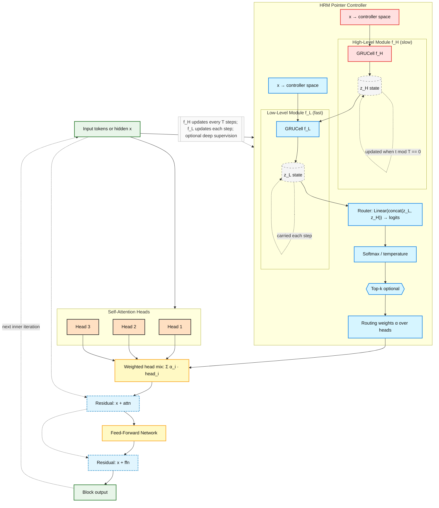

# Pointer-over-Heads (PoH) Transformer

**Dynamic-Routing Transformer with Iterative Refinement**

[]() [](LICENSE) []()

> **PoH** is a modular transformer architecture that adds **head-wise routing** and **iterative refinement** to standard transformers. Designed for tasks requiring multi-step reasoning 

## 🏗️ Architecture

### Visual Overview




## 🧠 PoT in Plain English — Thinking in the Embedding Space

PoT (Pointer-over-Heads Transformer) is built around a simple idea:
instead of producing its output in one forward pass, the model thinks through its representations over several refinement steps.

At the start, every token has an initial embedding — a rough guess of what it means in context.
PoT doesn’t stop there.
It runs the same Transformer stack R times, updating those embeddings after each pass.
At every step, the model looks at its current hidden states and asks:

“Given what I know now, how should I use my attention heads to refine this understanding?”

Each iteration slightly reshapes the embedding space.
Tokens move, cluster, and separate as their meanings become sharper and more contextually grounded.
This process is not about memorizing — it’s about progressive self-correction.
By the final iteration, the embeddings encode a richer, more internally consistent view of the sequence.

What makes PoT different is the controller that guides this process.
For every token and refinement step, the controller decides how strongly to use each attention head.
Some heads specialize in local structure, others in global dependencies or positional cues.
By adjusting their mixture across iterations, the model can “compose” reasoning stages — starting with local alignment, then moving toward abstract relations or long-range coherence.

The controller itself operates on two timescales:

A fast component that adapts on every refinement step — reacting immediately to the evolving state of each token.

A slow component that changes less frequently — maintaining a broader contextual plan that influences the fast dynamics.

Together, they form a kind of hierarchical reasoning loop inside the embedding space.
Rather than running deeper networks, PoT deepens its thinking process — continuously refining the meaning of each token until the hidden representations stabilize.

In other words:

PoT doesn’t just compute token embeddings — it thinks within them, iteratively reorganizing its own representation space to reach a more coherent internal understanding.


### Comparison to related ideas

- SAEs vs PoT
  - SAEs: post-hoc interpretability (discover fixed features/circuits).
  - PoT: online computation (learned controller modulates head usage during inference).

- MoE vs PoT

| Aspect | MoE | PoT |
|:--|:--|:--|
| Routing target | Experts (sub-networks) | Attention heads (within block) |
| Tokens processed | Sparse subset | All tokens |
| Computation | Sparse/efficient | Dense/iterative |
| Routing frequency | Once per forward | Every refinement step (R) |
| Controller | Shallow gate | Two-timescale (f_L fast, f_H slow) |
| Goal | Throughput/scale | Adaptive reasoning |


### Recursive Transformers (TRM) vs PoT

Reference: [Tiny Recursive Models (TRM)](https://github.com/SamsungSAILMontreal/TinyRecursiveModels)

| Aspect | TRM (TinyRecursiveModels) | PoT (Pointer‑over‑Heads) |
|:--|:--|:--|
| Motivation | Compress depth via recursive weight tying | Make attention adaptive via dynamic head routing |
| Iteration type | Reuse the same block output as next input (recurrence) | Iterative refinement with per‑token per‑head routing |
| Routing | None (uniform computation) | α[token, iter, head] changes every refinement step |
| Controller | None (deterministic recurrence) | Hierarchical controller: f_L (fast), f_H (slow, period T) |
| Granularity | Whole‑block | Attention‑head |
| Goal | Parameter efficiency (simulate deep nets) | Adaptive reasoning / dynamic information flow |

Summary: TRM repeats the same computation to act deeper; PoT refines the computation itself to act smarter. While both do multiple passes, TRM’s steps are uniform across tokens with tied weights, whereas PoT learns a two‑timescale controller to modulate each head’s contribution per token and per iteration.


### Installation

```bash
git clone https://github.com/Eran-BA/PoT.git
cd PoT
source venv/bin/activate  # Activate virtual environment
pip install pyyaml datasets  # For NLI benchmarks
```

**Key Components:**
- **HRM Controller**: Two-timescale recurrent modules (from HRM paper)
  - **f_L (HRM inner loop)**: Updates every refinement step - fast, reactive processing
  - **f_H (HRM outer loop)**: Updates every T steps (T=4) - slow, strategic planning
- **Router**: Produces per-token, per-head routing weights α from f_L state
- **Weighted Mix**: Combines attention heads based on α
- **Skip Connections**: Residual connections around attention and FFN
- **Refinement**: Model refines representation R times per forward pass (R=12 optimal)

### Hierarchy

```
IterRefiner                # R=12 refinement steps (optimal) + optional ACT halting
  ↓
PoHStack                   # N transformer blocks + positional encoding
  ↓
PoHBlock (×N)              # Head-wise routing (via HRM controller) + MHA + FFN
  ├─ HRM Controller       # f_L (inner loop) + f_H (outer loop) for routing
  ├─ HeadRouter           # Converts f_L state → routing logits
  ├─ MultiheadAttention   # Standard PyTorch MHA
  ├─ Weighted Mixing      # α-weighted head combination
  ├─ Residual #1          # x + dropout(attn)
  ├─ FeedForward          # Standard FFN
  └─ Residual #2          # x + dropout(ffn)
```

### Key Features

1. **Head-Wise Routing**: Dynamically select or weight attention heads per token
   - **Soft routing**: Differentiable softmax over heads
   - **Top-k routing**: Sparse binary mask (select top-k heads)
   - Controlled by **HRM inner loop (f_L)** - updates every refinement step

2. **Iterative Refinement**: Apply the stack R times for multi-step reasoning
   - **R=12 refinement steps optimal** (from empirical analysis)
   - Optional residual connections across refinement steps (ReZero-style)
   - ACT halting for adaptive computation

3. **Positional Encoding**: Config-switchable (none/absolute/rotary)
   - `"none"`: Permutation-invariant tasks
   - `"absolute"`: Learned embeddings (GPT-2 style)
   - `"rotary"`: RoPE (LLaMA style, optional)

4. **Parameter Parity**: **0.27% overhead** vs baseline TransformerEncoder
   - Lightweight router: `d_model → d_model/4 → n_heads`
   - Optional bias stripping to maintain parity

---

## 🚀 Applications & Benchmarks

### 1. Natural Language Inference (NLI)

### 2. Maze Solving with HRM (Scaling Benchmark)

**Test challenging pathfinding with proper maze generation:**

```bash
# Single test (20×20 mazes, min path 80)
pip install maze-dataset
python experiments/maze_ab_proper_generation.py

# Hyperparameter search (find optimal R, T, n_heads)
python experiments/maze_hyperparam_search.py --quick  # Fast test on 10×10
python experiments/analyze_maze_hyperparam_results.py results.csv
```

**See:** [Hyperparameter Search Guide](experiments/MAZE_HYPERPARAM_SEARCH_README.md)

**Features:**
- ✅ Uses [`maze-dataset`](https://github.com/understanding-search/maze-dataset) library for robust maze generation
- ✅ Minimum path length filtering (ensures challenging mazes)
- ✅ Proper train/test split (300 train, 50 test)
- ✅ 3-way comparison: **Baseline Transformer vs BERT vs PoH-HRM**
- ✅ Dynamic parameter parity for fair comparison
- ✅ GPU-optimized (A100 recommended for fast training)

**Metrics:**
- **Accuracy**: % of correct next-step predictions
- **Optimality**: % of paths matching optimal solution length

**Colab Notebooks:**
- **Single Size (20×20)**: [](https://colab.research.google.com/github/Eran-BA/PoT/blob/main/notebooks/Maze_AB_Test_Colab.ipynb)
- **Scaling Benchmark (8×8→30×30)**: [](https://colab.research.google.com/github/Eran-BA/PoT/blob/main/notebooks/Maze_Scaling_Benchmark_Colab.ipynb)

**Why this matters:** Maze solving tests hierarchical reasoning - HRM's two-timescale controller (f_L fast + f_H slow) should excel at long-horizon planning compared to single-timescale baselines.

### 3. Connect Four (Strategic Game Play)

**Test multi-step strategic reasoning:**

```bash
python experiments/connect_four_ab_test.py
```

- Minimax AI for optimal move generation
- Policy + value network training
- 3-way comparison: Baseline vs BERT vs PoH-HRM

**Colab:** [](https://colab.research.google.com/github/Eran-BA/PoT/blob/main/notebooks/Connect_Four_AB_Test_Colab.ipynb)

### 4. Synthetic Tasks (Partial-Observability Sorting)

See [examples/synthetic/README.md](examples/synthetic/README.md)

---

## 📓 Interactive Notebooks

Explore PoH interactively in Colab or Jupyter (maze first):

- **Maze_Scaling_Benchmark_Colab** 🆕 — Maze Scaling 8×8→30×30 (A100) [Recommended]
  
  [](https://colab.research.google.com/github/Eran-BA/PoT/blob/main/notebooks/Maze_Scaling_Benchmark_Colab.ipynb)

- **Maze_AB_Test_Colab** — Single-size Maze Solving (A100)
  
  [](https://colab.research.google.com/github/Eran-BA/PoT/blob/main/notebooks/Maze_AB_Test_Colab.ipynb)

- **PoH_NLI_Benchmark** — NLI (3 min)
  
  [](https://colab.research.google.com/github/Eran-BA/PoT/blob/main/notebooks/PoH_NLI_Benchmark.ipynb)

- **PoH_GPT_AB_Test** — Language Modeling (2 min)
  
  [](https://colab.research.google.com/github/Eran-BA/PoT/blob/main/notebooks/PoH_GPT_AB_Test.ipynb)

- **PoT_Colab** — Dependency Parsing (10–15 min)
  
  [](https://colab.research.google.com/github/Eran-BA/PoT/blob/main/notebooks/PoT_Colab.ipynb)

- **Connect_Four_AB_Test_Colab** — Connect Four (A100)
  
  [](https://colab.research.google.com/github/Eran-BA/PoT/blob/main/notebooks/Connect_Four_AB_Test_Colab.ipynb)

**See:** [notebooks/README.md](notebooks/README.md) for details

---

## 📊 Results


### Optimal Hyperparameters

**Task-specific recommendations:**
- **NLI/Language tasks**: R=12, T=4
- **Maze solving**: R=4, T=4
- **Sorting**: R=4, T=4

**See:** [docs/POH_ITERATION_GUIDE.md](docs/POH_ITERATION_GUIDE.md) for detailed analysis.

### Parameter Counts

**Configuration:** d=512, h=8, ff=2048, depth=6

| Model | Parameters | Delta | Notes |
|-------|------------|-------|-------|
| TransformerEncoder (baseline) | 18,914,304 | — | — |
| PoH (pos=none) | 18,965,680 | **+0.27%** ✅ | Routing overhead only |
| PoH (pos=absolute, L=512) | 19,227,824 | +1.66% | Includes positional embeddings |

**Breakdown:** HeadRouter (66k params) + head_gain (48 params) = **51k params (0.27%)**


---

## 🧪 Testing

```bash
# Run all tests
pytest tests/test_poh_modules.py -v

# Expected: 17 passed in ~1.3s
```

**Test coverage:**
- ✅ Parameter parity (≤1% delta)
- ✅ Routing correctness (soft sums to 1, top-k is sparse)
- ✅ ACT halting (reduces computation)
- ✅ Gradient flow (end-to-end)
- ✅ Positional encoding modes
- ✅ Outer residual (ReZero initialization)
- ✅ Drop-in compatibility with PyTorch

---

## 🎛️ Configuration

All features are config-driven via `PoHConfig`:

```python
cfg = PoHConfig(
    d_model=512, n_heads=8, d_ff=2048,
    route_mode="topk", route_topk=2,        # Sparse routing
    pos_encoding="absolute", max_seq_len=512,
    max_inner_iters=12,                     # R refinement steps
)
```

**Key parameters:** routing mode, refinement steps (R), HRM period (T), positional encoding. See `PoHConfig` docstring for full options.

---

## 📈 Logging & Visualization

Track per-iteration dynamics with `InnerLoopLogger` and visualize with provided scripts:

```bash
python scripts/plot_inner_vs_outer.py --csv results/run1/innerloop.csv
python scripts/plot_results.py
```

See [examples/poh_usage.py](examples/poh_usage.py) for usage.

---

## 📚 Documentation

### Quick Links
- **[docs/](docs/)** - Complete documentation index
- **[docs/architecture/](docs/architecture/)** - Architecture guides
- **[docs/guides/](docs/guides/)** - User & developer guides  
- **[examples/poh_usage.py](examples/poh_usage.py)** - 6 usage examples
- **[examples/synthetic/](examples/synthetic/)** - Synthetic task experiments

### Key Documents
- **[Terminology Guide](docs/TERMINOLOGY_GUIDE.md)** - **ESSENTIAL:** Official HRM-aligned terminology
- **[Architecture Summary](docs/architecture/POH_ARCHITECTURE_SUMMARY.md)** - Comprehensive architecture guide
- **[Refinement Iteration Guide](docs/POH_ITERATION_GUIDE.md)** - Why R=12 refinement steps is optimal
- **[HRM vs Refinement](docs/HRM_VS_REFINEMENT_LOOPS.md)** - Three nested loops explained
- **[Quick Start](QUICK_START.md)** - Copy-paste commands for NLI benchmarks
- **[Contributing Guide](docs/guides/CONTRIBUTING.md)** - Development guidelines
- **[Determinism Guide](docs/guides/DETERMINISM.md)** - Reproducibility best practices
- **[Running Benchmarks](docs/guides/RUNNING_BENCHMARKS.md)** - Full benchmark guide

---

## 🛠️ Development

### Requirements

- Python 3.9+
- PyTorch 2.0+
- NumPy, Matplotlib, Seaborn, SciPy, pandas, pytest, PyYAML

**Optional:**
- `rotary-embedding-torch` (for RoPE support)
- `datasets` (for real NLI benchmarks - Hugging Face)
- `maze-dataset` (for maze generation benchmarks)
- `transformers` (for BERT baselines in A/B tests)

### Project Structure

```
PoT/
├── src/
│   ├── pot/
│   │   ├── modules/          # PoHBlock, PoHStack, IterRefiner, Positional Encoding
│   │   ├── logging/          # Inner-loop CSV logger
│   │   ├── core/             # HRM controller, losses, metrics
│   │   ├── tasks/            # Task adapters (dependency parsing, NLI)
│   │   ├── utils/            # Training utilities
│   │   └── models/           # High-level models (PoHGPT, BERT baselines)
│   └── models/               # Legacy model definitions
├── scripts/
│   ├── train.py              # Unified training entry point
│   ├── plot_results.py       # Auto-plotting
│   ├── plot_inner_vs_outer.py  # Inner-loop visualization
│   └── make_readme_tables.py   # Table generation
├── tests/
│   ├── test_poh_modules.py   # 17 tests (all passing)
│   └── test_core.py          # Core component tests
├── examples/
│   ├── poh_usage.py          # Usage examples
│   ├── poh_gpt_usage.py      # GPT-style usage
│   └── synthetic/            # Synthetic tasks (sorting)
├── experiments/
│   ├── configs/              # YAML configs per task (parsing, nli, lm)
│   ├── results/              # Experiment CSVs
│   ├── quick_nli_test.py     # 3-min NLI test
│   ├── fair_ab_nli.py        # Full synthetic NLI benchmark
│   ├── real_nli_benchmark.py # Real SNLI/MultiNLI benchmark
│   ├── quick_ab_test.py      # GPT quick test
│   ├── fair_ab_lm.py         # Full GPT benchmark
│   ├── maze_ab_proper_generation.py  # Maze solving A/B test (with maze-dataset)
│   ├── maze_scaling_benchmark.py     # Maze scaling 8×8→30×30
│   └── connect_four_ab_test.py       # Connect Four A/B test
└── docs/
    ├── architecture/         # Architecture documentation
    ├── guides/               # User guides
    ├── tasks/                # Task-specific docs
    └── POH_ITERATION_GUIDE.md  # Iteration count guide
```

### Contributing

See [CONTRIBUTING.md](CONTRIBUTING.md) for development guidelines.

---

## 📖 Citation

```bibtex
@misc{benartzy2025poh,
  title={Pointer-over-Heads: Iterative Refinement with Head-Wise Routing},
  author={Eran Ben Artzy},
  year={2025},
  url={https://github.com/Eran-BA/PoT}
}
```

---

## 📄 License

Apache 2.0 - See [LICENSE](LICENSE) for details.

---

## 🙏 Acknowledgments & References

This work builds upon several foundational papers:

### Core Inspirations
- **Pointer Networks** - Vinyals et al. (2015): [https://arxiv.org/pdf/1506.03134](https://arxiv.org/pdf/1506.03134)
  - *Foundation for attention-based pointer mechanisms*
- **Hierarchical Reasoning Model (HRM)** - Lampinen & McClelland (2020): [https://arxiv.org/abs/2305.19472](https://arxiv.org/abs/2305.19472)
  - *Two-timescale recurrent controller for routing*

### Technical Components
- **ReZero** - Bachlechner et al. (2020): [https://arxiv.org/abs/2003.04887](https://arxiv.org/abs/2003.04887)
  - *Residual connection initialization for deep networks*
- **Adaptive Computation Time (ACT)** - Graves (2016): [https://arxiv.org/abs/1603.08983](https://arxiv.org/abs/1603.08983)
  - *Learned halting for variable computation*
- **Transformer** - Vaswani et al. (2017): [https://arxiv.org/abs/1706.03762](https://arxiv.org/abs/1706.03762)
  - *Base architecture*

### Technical Components (continued)
- **maze-dataset** - Ivanitskiy et al. (2023): [https://arxiv.org/abs/2309.10498](https://arxiv.org/abs/2309.10498)
  - *High-quality maze generation library for ML benchmarking*

### Implementation
- Built on PyTorch's `MultiheadAttention`
- Evaluation metrics from Universal Dependencies project
- Maze generation using [`maze-dataset`](https://github.com/understanding-search/maze-dataset) library

---

## 🚀 Status

**v1.1.0** - Active Development 🚧

### Core Architecture ✅
- [x] Modular architecture (PoHBlock → PoHStack → IterRefiner)
- [x] HRM controller integration (two-timescale routing)
- [x] Parameter parity (0.27% overhead)
- [x] Config-switchable positional encoding
- [x] Inner-loop logging & visualization
- [x] 17/17 tests passing
- [x] Comprehensive documentation

### Benchmarks & Applications ✅
- [x] **NLI benchmarks (BERT vs PoH)** - +52.58% improvement
- [x] **GPT-style autoregressive model (PoH-GPT)**
- [x] **Optimal hyperparameters** (R=12, T=4 for NLI; R=4, T=4 for mazes)
- [x] **Maze solving benchmark** (with `maze-dataset` library)
- [x] **Maze scaling benchmark** (8×8 → 30×30)
- [x] **Connect Four strategic game play**
- [x] **A/B testing framework** (Baseline vs BERT vs PoH-HRM)
- [x] **Colab notebooks** (GPU-optimized, A100 support)

### In Progress 🔄
- [ ] Maze benchmark results analysis (running now)
- [ ] Dependency parsing baselines (Dozat-Manning, transformer+biaffine)
- [ ] Multi-language evaluation (UD)
- [ ] Publication-ready results

### Planned 📋
- [ ] RNN/LSTM baselines for sequential tasks
- [ ] Attention visualization tools
- [ ] Interactive demos

---

**Questions?** Open an issue or see [QUICK_START.md](QUICK_START.md) for copy-paste commands!
