# Pointer-over-Heads Transformer (PoT)

**Dynamic multi-head attention with adaptive routing for dependency parsing**

**Author:** Eran Ben Artzy

---

## Architecture

```mermaid
flowchart TB
  %% Styles
  classDef head fill:#ffe0c2,stroke:#333,stroke-width:2px,color:#111
  classDef ctrl fill:#cfe8ff,stroke:#333,stroke-width:2px,color:#111
  classDef io fill:#e8f5e9,stroke:#333,stroke-width:2px,color:#111
  classDef mix fill:#fff9c4,stroke:#333,stroke-width:2px,color:#111
  
  %% Nodes
  X[Input]:::io
  
  PC[Pointer Controller<br/>softmax over heads]:::ctrl
  
  subgraph SA[Self-Attention Heads ]
    direction LR
    H1[Head 1]:::head
    H2[Head 2]:::head
    H3[Head 3]:::head
  end
  
  MIX[Weighted/Selected<br/>Head Output]:::mix
  Y[Output]:::io
  
  %% Forward pass
  X --> PC
  PC -->|α₁| H1
  PC -->|α₂| H2
  PC -->|α₃| H3
  
  H1 --> MIX
  H2 --> MIX
  H3 --> MIX
  
  MIX --> Y
  
  %% Feedback cycles (recurrent control)
  H1 -.feedback.-> PC
  H2 -.feedback.-> PC
  H3 -.feedback.-> PC
  
  %% Optional recurrence over time
  Y -.next step context.-> PC
```



---

## 📁 Project Structure

The codebase is organized into logical modules for clarity and maintainability:

```
PoT/
├── src/                          # Source code
│   ├── models/                   # Model architectures
│   │   ├── base.py              # ParserBase class
│   │   ├── baseline.py          # Baseline parser
│   │   ├── poh.py               # PoH parser with all features
│   │   ├── pointer_block.py     # PoH transformer block
│   │   └── layers.py            # Biaffine, MHA, controller layers
│   ├── data/                     # Data loading & processing
│   │   ├── loaders.py           # HF, CoNLL-U, dummy datasets
│   │   └── collate.py           # Batching & tokenization
│   ├── training/                 # Training logic
│   │   ├── trainer.py           # Main trainer class
│   │   └── schedulers.py        # LR schedulers
│   ├── evaluation/               # Evaluation tools
│   │   └── conll_eval.py        # CoNLL-U evaluation
│   └── utils/                    # Utility functions
│       ├── helpers.py           # Pooling, padding, targets
│       ├── logger.py            # CSV logging
│       ├── metrics.py           # UAS/LAS computation
│       ├── conllu_writer.py     # CoNLL-U export
│       ├── iterative_losses.py  # Deep supervision, ACT
│       └── trm_losses.py        # TRM-style losses
├── scripts/                      # Executable scripts
│   ├── train.py                 # Main A/B training script
│   ├── run_ablations.py         # Ablation studies
│   ├── run_multiseed.sh         # Multi-seed runner
│   └── run_entropy_sweep.sh     # Entropy threshold sweep
├── tools/                        # Analysis tools
│   ├── count_params.py          # Parameter counting
│   ├── plot_results.py          # Comprehensive plotting
│   └── plot_simple.py           # Quick plotting
├── docs/                         # Documentation
│   ├── DEEP_SUPERVISION_GUIDE.md
│   └── GRADIENT_MODES_THEORY.md
├── notebooks/                    # Jupyter notebooks
│   └── PoT_Colab.ipynb          # Google Colab notebook
├── tests/                        # Unit tests
│   └── test_imports.py          # Import validation
├── data/                         # Data directory (gitignored)
├── setup.py                      # Pip installation
├── requirements.txt              # Dependencies
└── README.md                     # This file
```

### Installation

```bash
# Clone repository
git clone https://github.com/YOUR_USERNAME/PoT.git
cd PoT

# Install in development mode
pip install -e .

# Or install dependencies directly
pip install -r requirements.txt
```

---

## 🎯 Implementation Status

**Core Features** (✅ Complete):
- ✅ Pointer-over-Heads transformer architecture
- ✅ Baseline vs PoH A/B comparison
- ✅ Multi-head routing (soft, top-k)
- ✅ Adaptive halting (fixed, entropy, ACT-style)
- ✅ Deep supervision for iterative refinement
- ✅ Gradient modes (full BPTT / last-iterate HRM-style)
- ✅ UAS and LAS support with biaffine labeler
- ✅ Parameter matching (`--param_match`)
- ✅ Encoder freezing (`--freeze_encoder`)
- ✅ CoNLL-U export (`--emit_conllu`)
- ✅ Punctuation masking (`--ignore_punct`)
- ✅ CSV logging (auto-generated)
- ✅ Multi-seed runner (`run_multiseed.sh`)
- ✅ Visualization suite

**Integrated Utilities** (✅):
- ✅ `utils/logger.py` - CSV logging with timestamp
- ✅ `utils/conllu_writer.py` - Prediction export for evaluation
- ✅ `utils/metrics.py` - UAS/LAS with punctuation masking
- ✅ `utils/iterative_losses.py` - Deep supervision & ACT losses
- ✅ `utils/diagnostics.py` - Distance-bucket analysis (placeholder)

**Documentation** (✅):
- ✅ `DEEP_SUPERVISION_GUIDE.md` - Implementation guide for iterative refinement
- ✅ `GRADIENT_MODES_THEORY.md` - Mathematical foundations for gradient modes

---

## Installation

```bash
# Clone repository
git clone https://github.com/Eran-BA/PoT.git
cd PoT

# Install dependencies
pip install -r requirements.txt
```

## Quick Start

### 1. Verify Installation (2 minutes)

```bash
# Quick sanity check with dummy data
python scripts/train.py --data_source dummy --epochs 2 --batch_size 8
```

### 2. Download Real Data (1 minute)

```bash
# Download UD English EWT dataset
mkdir -p ud_data
wget https://raw.githubusercontent.com/UniversalDependencies/UD_English-EWT/master/en_ewt-ud-train.conllu -O ud_data/en_ewt-ud-train.conllu
wget https://raw.githubusercontent.com/UniversalDependencies/UD_English-EWT/master/en_ewt-ud-dev.conllu -O ud_data/en_ewt-ud-dev.conllu
wget https://raw.githubusercontent.com/UniversalDependencies/UD_English-EWT/master/en_ewt-ud-test.conllu -O ud_data/en_ewt-ud-test.conllu
```

### 3. Run A/B Comparison (10 minutes)

```bash
# Baseline vs PoH with optimal config
python scripts/train.py \
  --data_source conllu --conllu_dir ud_data \
  --epochs 3 --batch_size 32 --lr 3e-5 \
  --max_inner_iters 1 --routing_topk 0 \
  --param_match baseline --log_csv results.csv
```

---

## Complete Experimental Pipeline

### Step 1: Setup (5 min)

```bash
git clone https://github.com/Eran-BA/PoT.git
cd PoT
pip install -r requirements.txt

# Download UD English EWT dataset
mkdir -p ud_data
wget https://raw.githubusercontent.com/UniversalDependencies/UD_English-EWT/master/en_ewt-ud-train.conllu -O ud_data/en_ewt-ud-train.conllu
wget https://raw.githubusercontent.com/UniversalDependencies/UD_English-EWT/master/en_ewt-ud-dev.conllu -O ud_data/en_ewt-ud-dev.conllu
wget https://raw.githubusercontent.com/UniversalDependencies/UD_English-EWT/master/en_ewt-ud-test.conllu -O ud_data/en_ewt-ud-test.conllu
```

### Step 2: A/B Comparison (20 min)

```bash
# Optimal configuration: 1 iteration, soft routing, parameter-matched
python scripts/train.py \
  --data_source conllu --conllu_dir ud_data \
  --epochs 5 --batch_size 32 --lr 3e-5 \
  --max_inner_iters 1 --routing_topk 0 \
  --param_match baseline --ignore_punct \
  --log_csv results.csv
```

### Step 3: Core Ablations (30 min)

```bash
# Test iterations: 1 is optimal, but test 2-3 for diminishing returns
for iters in 1 2 3; do
  python scripts/train.py \
    --data_source conllu --conllu_dir ud_data \
    --epochs 3 --batch_size 32 --lr 3e-5 \
    --max_inner_iters $iters --routing_topk 0 \
    --log_csv ablations.csv
done

# Test routing: soft (0) vs hard top-2 (2)
for topk in 0 2; do
  python scripts/train.py \
    --data_source conllu --conllu_dir ud_data \
    --epochs 3 --batch_size 32 --lr 3e-5 \
    --max_inner_iters 1 --routing_topk $topk \
    --log_csv ablations.csv
done
```

### Step 4: Multi-Seed Robustness (30 min)

```bash
# Optimal config with 3 seeds
for seed in 42 1337 2023; do
  python scripts/train.py \
    --data_source conllu --conllu_dir ud_data \
    --epochs 5 --batch_size 32 --lr 3e-5 \
    --max_inner_iters 1 --routing_topk 0 \
    --param_match baseline \
    --seed $seed --log_csv multiseed.csv
done
```

### Step 5: Visualization (5 min)

```bash
python plot_simple.py multiseed.csv --out results.png
```

**Key Findings:**
- **1 iteration is optimal** for UD English EWT dependency parsing
- Diminishing returns beyond 1 iteration (near-contractive task)
- Soft routing (topk=0) provides best performance
- Parameter overhead: +676K (~0.9%) over baseline

---

## Usage

### Basic Parser

Run the standalone parser:

```bash
python ud_pointer_parser.py --epochs 2 --batch_size 8 --halting_mode entropy --max_inner_iters 3 --routing_topk 2
```

### A/B Comparison: Baseline vs PoH

```bash
# Using local CoNLL-U files (recommended)
python scripts/train.py \
  --data_source conllu --conllu_dir ud_data \
  --epochs 5 --batch_size 32 --lr 3e-5

# Quick test with dummy data
python scripts/train.py --data_source dummy --epochs 2 --batch_size 8
```

### Multi-Seed Reproducibility

```bash
# Manual runs with different seeds
for seed in 42 1337 2023; do
  python scripts/train.py \
    --data_source conllu --conllu_dir ud_data \
    --epochs 5 --batch_size 32 \
    --seed $seed --log_csv results.csv
done
```

### Ablation Studies

Run comprehensive ablation studies to understand what components matter:

```bash
# Quick mode (2 epochs per config)
python run_ablations.py --quick

# Full ablation suite
python run_ablations.py

# Specific ablation only
python run_ablations.py --ablation iterations
python run_ablations.py --ablation routing
python run_ablations.py --ablation halting

# Multi-seed evaluation for best config
python run_ablations.py --multiseed
```

### Key Configuration Options

**Data Sources:**
- `--data_source conllu`: Local CoNLL-U files (recommended)
- `--data_source dummy`: Small synthetic dataset for testing

**Using Local CoNLL-U Files:**
```bash
# Download UD English EWT
mkdir -p ud_data
wget https://raw.githubusercontent.com/UniversalDependencies/UD_English-EWT/master/en_ewt-ud-train.conllu -O ud_data/en_ewt-ud-train.conllu
wget https://raw.githubusercontent.com/UniversalDependencies/UD_English-EWT/master/en_ewt-ud-dev.conllu -O ud_data/en_ewt-ud-dev.conllu

python scripts/train.py \
  --data_source conllu --conllu_dir ud_data \
  --epochs 5 --batch_size 32
```

**PoH Parameters:**
- `--max_inner_iters N`: Number of refinement iterations (1-10, default: 3)
- `--routing_topk K`: Top-K head selection (0=soft mixture, 1-8=hard routing, default: 2)
- `--halting_mode MODE`: fixed/entropy/halting (default: entropy)
- `--ent_threshold FLOAT`: Entropy threshold for early stopping (default: 0.8)
- `--combination MODE`: mask_concat/mixture (default: mask_concat)

**Training:**
- `--lr FLOAT`: Learning rate (default: 5e-5)
- `--weight_decay FLOAT`: Weight decay (default: 0.01)
- `--warmup_ratio FLOAT`: LR warmup ratio (default: 0.05 = 5%)
- `--batch_size INT`: Batch size (default: 8)
- `--seed INT`: Random seed for reproducibility (default: 42)
- `--log_csv FILE`: CSV file for logging results (auto-generated if not provided)

**Advanced Options:**
- `--param_match {baseline,poh}`: Automatically match parameter counts
  - `baseline`: Boost baseline FFN to match PoH params
  - `poh`: Reduce PoH FFN to match baseline params
- `--freeze_encoder`: Freeze pretrained encoder (only train parsing layers)
- `--ignore_punct`: Ignore punctuation tokens in UAS/LAS computation
- `--emit_conllu`: Write predictions to CoNLL-U format for official evaluation

**Iterative Refinement (Advanced):**
- `--deep_supervision`: Enable auxiliary losses on intermediate iterations
- `--act_halting`: Enable ACT-style differentiable halting with ponder cost
- `--ponder_coef FLOAT`: Ponder coefficient for ACT halting (default: 1e-3)
- `--ramp_strength FLOAT`: Deep supervision ramp strength 0-1 (default: 1.0)
- `--grad_mode {full,last}`: Gradient mode (default: full)
  - `full`: Full BPTT through all iterations
  - `last`: HRM-style last-iterate gradients (memory efficient)

For detailed information on these features, see [`DEEP_SUPERVISION_GUIDE.md`](DEEP_SUPERVISION_GUIDE.md) and [`GRADIENT_MODES_THEORY.md`](GRADIENT_MODES_THEORY.md).

### Parameter Matching for Fair Comparison

```bash
# Boost baseline to match PoH parameters
python scripts/train.py \
  --data_source conllu --conllu_dir ud_data \
  --param_match baseline

# Freeze encoder to only train parsing head
python scripts/train.py \
  --data_source conllu --conllu_dir ud_data \
  --freeze_encoder
```

## Model Comparison

**Parameter counts** (with distilbert-base-uncased encoder):
- Baseline Parser: ~72.5M parameters
- PoH Parser: ~73.1M parameters
- **Overhead: +676K parameters (~0.93% increase)**

The PoH architecture adds minimal parameters while providing:
- Dynamic computation through adaptive routing
- Better accuracy through iterative refinement
- More interpretable attention patterns

## Evaluation Metrics

The parser supports both **UAS (Unlabeled Attachment Score)** and **LAS (Labeled Attachment Score)**:

- **UAS**: Percentage of tokens with correct head attachment
- **LAS**: Percentage of tokens with both correct head and correct dependency label

LAS is automatically enabled when dependency labels (`deprel`) are available in the training data.

### CoNLL-U Format Evaluation

For official UD evaluation metrics, use the CoNLL evaluation script:

```bash
python conll_eval.py gold.conllu predictions.conllu
```

This provides:
- UAS and LAS scores
- Per-relation breakdown
- Complete tree accuracy
- Compatible with CoNLL 2018 shared task format


## Visualization

### Comprehensive Plots
Generate publication-quality figures from ablation results:

```bash
# Plot all results
python plot_results.py ablation_results_TIMESTAMP.csv

# Specific plot types
python plot_results.py results.csv --plot_type ablations
python plot_results.py results.csv --plot_type learning_curves
python plot_results.py results.csv --plot_type comparison
python plot_results.py results.csv --plot_type iters
python plot_results.py results.csv --plot_type seeds
```

Generated plots include:
- **Ablation comparisons**: Bar charts comparing configs within each ablation
- **Learning curves**: UAS progression over epochs
- **Baseline vs PoH**: Direct improvement comparison
- **Iterations vs Accuracy**: Relationship between inner iterations and performance
- **Multi-seed variance**: Stability across random seeds

### Quick Plot
For rapid iteration:

```bash
# Simple UAS vs iterations scatter plot
python plot_simple.py results.csv --out quick_plot.png
```

## Results

We evaluate the Pointer-over-Heads (PoH) Transformer on **Universal Dependencies English EWT** with a parameter-matched comparison against a vanilla Multi-Head Attention baseline. PoH achieves improvements in both UAS and LAS with minimal parameter overhead (~0.9%).

### Key Findings

**Optimal Configuration:**
- **1 inner iteration** is optimal for UD English EWT dependency parsing
- **Soft routing** (topk=0) provides best performance
- **Parameter overhead:** +676K (~0.9%) over baseline
- **Near-contractive task:** Diminishing returns beyond 1 iteration suggests dependency parsing is already well-solved by single-pass attention

**Why 1 iteration works:**
Dependency parsing with self-attention is a **locally-contractive task** where:
- Global information propagates quickly through attention
- Token representations converge within one pass
- Additional iterations provide minimal refinement
- This validates the **HRM-style last-iterate gradient** justification (see `GRADIENT_MODES_THEORY.md`)

**Advanced Features:**
- **Deep Supervision:** Provides stronger training signal for multi-iteration configs
- **ACT-style Halting:** Enables adaptive computation when beneficial
- **Gradient Modes:** Full BPTT vs last-iterate (memory-efficient)

*Run the [Colab notebook](#google-colab) for complete experiments and analysis.*

---

## Google Colab

Try it in your browser with zero setup:

[](https://colab.research.google.com/github/Eran-BA/PoT/blob/main/PoT_Colab.ipynb)

The Colab notebook includes:
- Quick dummy data test
- Full UD training pipeline  
- Multi-seed evaluation
- Automatic visualization
- Result download

## Repository Structure

```
PoT/
├── pointer_over_heads_transformer.py  # Core PoH transformer implementation
├── ud_pointer_parser.py               # Basic UD parser with PoH
├── ab_ud_pointer_vs_baseline.py       # A/B comparison script (Baseline vs PoH)
├── run_ablations.py                   # Automated ablation study runner
├── run_multiseed.sh                   # Multi-seed experiment runner
├── count_params.py                    # Parameter counting utility
├── conll_eval.py                      # CoNLL-U evaluation script
├── plot_results.py                    # Comprehensive visualization suite
├── plot_simple.py                     # Quick UAS vs iterations plot
├── PoT_Colab.ipynb                    # Google Colab notebook
├── requirements.txt                   # Python dependencies
├── LICENSE                            # Apache 2.0 license
├── README.md                          # This file
└── utils/
    ├── logger.py                      # CSV logging utilities
    ├── conllu_writer.py              # CoNLL-U format writer
    └── metrics.py                     # Evaluation metrics with punct masking
```

## Citation

If you use this code in your research, please cite:

```bibtex
@software{benartzy2025pot,
  title={Pointer-over-Heads Transformer: Dynamic Multi-Head Attention with Adaptive Routing},
  author={Ben Artzy, Eran},
  year={2025},
  url={https://github.com/Eran-BA/PoT},
  note={GitHub repository}
}
```

## License

This project is licensed under the Apache License 2.0 - see the [LICENSE](LICENSE) file for details.