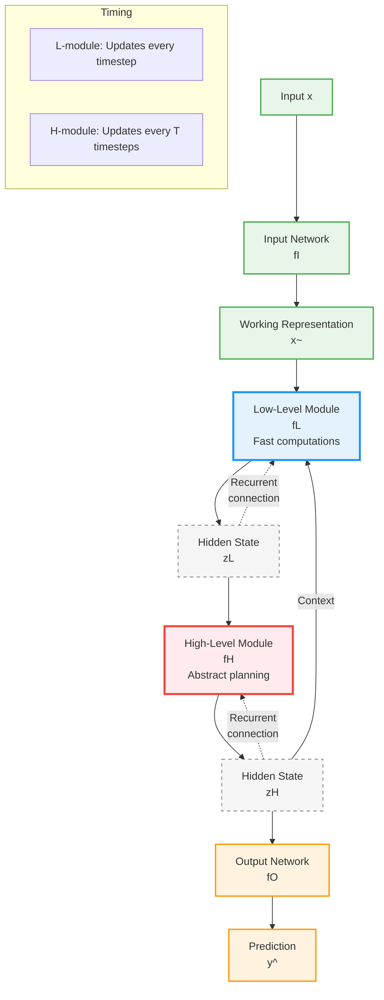

# HRM Loops vs Refinement Iterations: Complete Clarification

## ⚠️ **Important: Two Different "Loop" Concepts!**

The PoH architecture combines **two independent loop mechanisms**:

1. **HRM's Inner/Outer Loops** (Two-timescale controller)
2. **Refinement Inner/Outer Iterations** (Iterative processing)

These are **NOT the same thing!** Let's clarify both.

---

## 1️⃣ **HRM's Inner/Outer Loops** (Controller Timescales)

From the [Hierarchical Reasoning Model paper](https://arxiv.org/abs/2305.19472):

### Architecture



### Key Concepts

**Inner Loop (Low-Level fL):**
- ✅ Updates **every timestep** (t=1, 2, 3, ...)
- ✅ Fast, reactive processing
- ✅ Receives context from high-level module
- ✅ Maintains state `z_L`

**Outer Loop (High-Level fH):**
- ✅ Updates **every T timesteps** (t=T, 2T, 3T, ...)
- ✅ Slow, strategic planning
- ✅ Provides guidance to low-level module
- ✅ Maintains state `z_H`

**Purpose:** Two-timescale processing for hierarchical reasoning

---

## 2️⃣ **Refinement Inner/Outer Iterations** (PoH Processing)

In the PoH architecture:

### Architecture

```
Training Loop (Outer Iterations = Training Steps)
  ↓
  for step in range(max_steps):  # e.g., 20,000 steps
      ↓
      Forward Pass (Inner Iterations = Refinement)
        ↓
        h = x
        for t in range(max_inner_iters):  # e.g., 12 iterations
            h = PoHStack(h)  # Refine representation
            # h feeds back as input
        ↓
      Backward Pass
      ↓
      Update Weights
```

### Key Concepts

**Inner Iterations (Refinement):**
- ✅ Refinement steps **within one forward pass**
- ✅ Model processes input K times (K=12 optimal)
- ✅ All happen before computing loss
- ✅ Controlled by `max_inner_iters`

**Outer Iterations (Training):**
- ✅ Gradient descent steps
- ✅ Each step: forward + backward + update
- ✅ Controlled by `max_steps` or `epochs`

**Purpose:** Iterative refinement for multi-step reasoning

---

## 🔄 **How They Combine in PoH**

The PoH architecture uses **BOTH** mechanisms simultaneously!

### Complete Picture

```
Training Step (Outer Iteration #1):
  ↓
  Refinement Iteration 1 (Inner Iteration #1):
    ↓
    Token 1: HRM controller (fL updates, fH maybe updates) → routing
    Token 2: HRM controller (fL updates, fH maybe updates) → routing
    ...
    Token N: HRM controller (fL updates, fH maybe updates) → routing
  ↓
  Refinement Iteration 2 (Inner Iteration #2):
    ↓
    Token 1: HRM controller (fL updates, fH maybe updates) → routing
    Token 2: HRM controller (fL updates, fH maybe updates) → routing
    ...
    Token N: HRM controller (fL updates, fH maybe updates) → routing
  ↓
  ... (repeat for 12 refinement iterations)
  ↓
  Refinement Iteration 12 (Inner Iteration #12):
    ↓
    Token 1: HRM controller (fL updates, fH maybe updates) → routing
    Token 2: HRM controller (fL updates, fH maybe updates) → routing
    ...
    Token N: HRM controller (fL updates, fH maybe updates) → routing
  ↓
  Compute Loss → Backward → Update Weights
```

### Three Levels of "Loops"

1. **Training Loop** (Outer iterations): 20,000 steps
   - Gradient descent
   - Controlled by `max_steps`

2. **Refinement Loop** (Inner iterations): 12 per forward pass
   - Iterative processing
   - Controlled by `max_inner_iters`

3. **HRM Timescales** (Inner/Outer loops): Every token
   - fL updates every refinement step
   - fH updates every T refinement steps
   - Controlled by `T` parameter (default: 4)

---

## 📊 **Terminology Comparison**

| Concept | HRM Paper Term | PoH Code Term | Updates When | Purpose |
|---------|----------------|---------------|--------------|---------|
| Low-level module | **Inner loop** | `f_L` | Every step | Fast processing |
| High-level module | **Outer loop** | `f_H` | Every T steps | Strategic planning |
| Refinement | N/A | **Inner iterations** | K times per forward | Multi-step reasoning |
| Training | N/A | **Outer iterations** | Every gradient step | Weight optimization |

---

## 🎯 **Practical Example: NLI Benchmark**

### Configuration

```yaml
# HRM Controller Settings
T: 4  # fH updates every 4 refinement steps

# Refinement Settings
max_inner_iters: 12  # 12 refinement iterations per forward pass

# Training Settings
max_steps: 20000  # 20,000 training steps
```

### What Happens

```
Training Step 1:
  Forward Pass:
    Refinement Iter 1: fL updates (step 1), fH updates (step 1 % 4 == 1? no)
    Refinement Iter 2: fL updates (step 2), fH updates (step 2 % 4 == 2? no)
    Refinement Iter 3: fL updates (step 3), fH updates (step 3 % 4 == 3? no)
    Refinement Iter 4: fL updates (step 4), fH updates (step 4 % 4 == 0? YES!)
    Refinement Iter 5: fL updates (step 5), fH updates (step 5 % 4 == 1? no)
    ...
    Refinement Iter 12: fL updates (step 12), fH updates (step 12 % 4 == 0? YES!)
  Backward Pass
  Update Weights

Training Step 2:
  Forward Pass:
    Refinement Iter 1: fL updates, fH maybe
    ...
    Refinement Iter 12: fL updates, fH maybe
  Backward Pass
  Update Weights

... (repeat 20,000 times)
```

### Counting

- **Training steps (outer iterations):** 20,000
- **Refinement iterations per forward (inner iterations):** 12
- **Total refinement iterations:** 20,000 × 12 = 240,000
- **fL updates:** 240,000 (every refinement step)
- **fH updates:** 240,000 / 4 = 60,000 (every T refinement steps)

---

## 🔍 **Code Locations**

### HRM Inner/Outer Loops

**File:** `src/pot/core/hrm_controller.py`

```python
class HRMPointerController(nn.Module):
    def __init__(self, ..., T: int = 4):
        self.T = T  # Period for fH updates
        self.f_L = nn.GRUCell(...)  # Inner loop (fast)
        self.f_H = nn.GRUCell(...)  # Outer loop (slow)
    
    def forward(self, x, state):
        # Update fH every T steps (outer loop)
        if (state.step % self.T) == 0:
            z_H_new = self.f_H(x_ctrl, state.z_H)
        
        # Update fL every step (inner loop)
        l_inp = torch.cat([x_ctrl, state.z_H], dim=-1)
        z_L_new = self.f_L(l_inp, state.z_L)
        
        # Route based on fL state
        logits = self.router(z_L_new)
        return logits, new_state
```

### Refinement Inner/Outer Iterations

**File:** `src/pot/modules/block.py`

```python
class IterRefiner(nn.Module):
    def __init__(self, stack, max_inner_iters: int = 12):
        self.K = max_inner_iters  # Refinement iterations
    
    def forward(self, x):
        h = x
        for t in range(self.K):  # Inner iterations (refinement)
            h = self.stack(h)  # Each call updates HRM controller
        return h

# Training loop (outer iterations)
for step in range(max_steps):  # Outer iterations (training)
    output = refiner(x)  # Does K inner iterations
    loss.backward()
    optimizer.step()
```

---

## ✅ **Summary: The Complete Picture**

**PoH combines three nested loops:**

```
1. Training Loop (20,000 steps)
   ↓
   2. Refinement Loop (12 iterations per forward)
      ↓
      3. HRM Timescales (fL every step, fH every T steps)
```

**Terminology:**
- **HRM paper:** "Inner loop" = fL, "Outer loop" = fH
- **PoH code:** "Inner iterations" = refinement, "Outer iterations" = training
- **These are different concepts!**

**Key Parameters:**
- `T = 4`: fH update period (HRM outer loop)
- `max_inner_iters = 12`: Refinement iterations (PoH inner iterations)
- `max_steps = 20000`: Training steps (PoH outer iterations)

**All three work together:**
- HRM provides dynamic routing at each refinement step
- Refinement allows multi-step reasoning per forward pass
- Training optimizes the entire system

---

## 📚 **See Also**

- [INNER_VS_OUTER_ITERATIONS.md](INNER_VS_OUTER_ITERATIONS.md) - Refinement iterations explained
- [POH_ITERATION_GUIDE.md](POH_ITERATION_GUIDE.md) - Choosing optimal K=12
- [src/pot/core/hrm_controller.py](../src/pot/core/hrm_controller.py) - HRM implementation
- [src/pot/modules/block.py](../src/pot/modules/block.py) - IterRefiner implementation

---

**Last Updated:** October 2025  
**Key Insight:** HRM's "inner/outer loops" (timescales) ≠ PoH's "inner/outer iterations" (refinement/training)

